# EduWebTemplateGenerator

A standalone Arabic (RTL) engine that turns **JSON into a finished, interactive, print-ready A4
sheet** — worksheets, review cards, lesson plans, session cards, surveys. No build step, no
dependencies, no framework: the browser app is plain ES modules and the server is Node's own `http`.

```bash
docker compose up          # or: npm start      →  http://localhost:8138
```

```
http://localhost:8138/index.html?lesson=science-g1-plant-parts
```

To publish a new sheet you never touch the HTML or the CSS. You add one JSON file — or one database
record, and let the pipeline build it for you.

It is **institution-neutral**. Nothing in the engine names a school, a district or a country: the
logo is one file you replace, the organisation lines default to empty, and the lesson source is
whatever you point it at.

---

## Start here

**[→ The lifecycle](docs/LIFECYCLE.md)** — the nine stages every sheet travels, end to end, with the
code path for each. If you read one page, read that one.

```
 SOURCE → BUILD → RENDER → PUBLISH →┬→ USE      (print · present · embed)
                                    └→ ISSUE → ANSWER → GRADE → ANALYSE → DELIVER → READ
```

| document | what is in it |
|---|---|
| **[LIFECYCLE.md](docs/LIFECYCLE.md)** | the nine stages, their inputs, outputs and code |
| **[TEMPLATES.md](docs/TEMPLATES.md)** | the six templates, the two ages, colors, presenting, printing |
| **[JSON.md](docs/JSON.md)** | every field of every template — the authoring reference |
| **[API.md](docs/API.md)** | the render API, the URL contract, `config.js`, the JS API |
| **[PIPELINE.md](docs/PIPELINE.md)** | lesson → document → assign → grade → report, endpoint by endpoint |
| **[DATABASE.md](docs/DATABASE.md)** | the two MongoDB databases: every collection, and what writes it |
| **[DEPLOY.md](docs/DEPLOY.md)** | Docker, environment, the logo, embedding, content protection |
| **[EXTENDING.md](docs/EXTENDING.md)** | project structure · a new activity · a new template · a new type |

---

## Quick start

Pick **one**. All three end up at <http://localhost:8138>.

```bash
cp env.example .env          # option 1 only — compose reads this file and will not start without it
docker compose up            # 1 · Docker — nothing to install but Docker itself
npm start                    # 2 · Node ≥ 18 — site + render API, zero dependencies
python -m http.server 8138   # 3 · any static server — site only, no API
```

Then open a lesson:

```
http://localhost:8138/index.html?lesson=science-g1-plant-parts
```

Bundled lessons, one per template:

| id | template |
|---|---|
| `science-g1-plant-parts` | `worksheet` |
| `science-g2-living-creatures-needs` | `worksheet` (the default) |
| `physics-g9-newton-laws` | `worksheet`, pro |
| `arabic-g5-sentence-types-cards` | `interactive-card` |
| `digital-g7-cyber-safety-answers` | `interactive-card-answers` |
| `math-g7-linear-equations-diff` | `differentiated-lesson` |
| `golden-minutes-card` | `golden-minutes` |
| `learning-pattern-survey` | `learning-pattern` |

Or send your own JSON straight to the renderer, with no lesson id and no database:

```bash
curl -X POST http://localhost:8138/api/render \
     -H 'Content-Type: application/json' \
     -d @my-sheet.json -o sheet.html
```

---

## Six templates, two ages, any color

The JSON declares all of it; the engine does the rest.

| `meta.template` | What it produces | On screen |
|---|---|---|
| `worksheet` | the full student worksheet — a 3-column grid of activity cards | answerable |
| `interactive-card` | cut-out review **question** cards, 2×N with scissor guides | answerable |
| `interactive-card-answers` | the matching **model-answer** cards, with note + skill + score | read-only |
| `differentiated-lesson` | a complete **differentiated-instruction lesson plan** | read-only |
| `golden-minutes` | the teacher's **golden-minutes card** (بطاقة الدقائق الذهبية) | fillable |
| `learning-pattern` | the **learning-styles survey** (استبيان تحديد أنماط التعلم) | answerable |

| `meta.age` | Audience | Look |
|---|---|---|
| `kid` (aliases: `kids`, `child`, `playful`, `primary`) | primary school | colorful per-card borders, round badges, pill chrome, emoji-friendly |
| `pro` (aliases: `professional`, `teen`, `formal`, `adult`) | ages 12–18 / formal | one accent color, line-art icons, document-style chrome |

`meta.color` sets the sheet color — a hex (`"#177a6c"`) or a palette name (`"teal"`).

```jsonc
"meta": { "template": "interactive-card", "age": "pro", "color": "#177a6c" }
```

Every template prints to **exactly one A4 page** — verified by PDF render, not by eyeballing.

### Worksheet

| 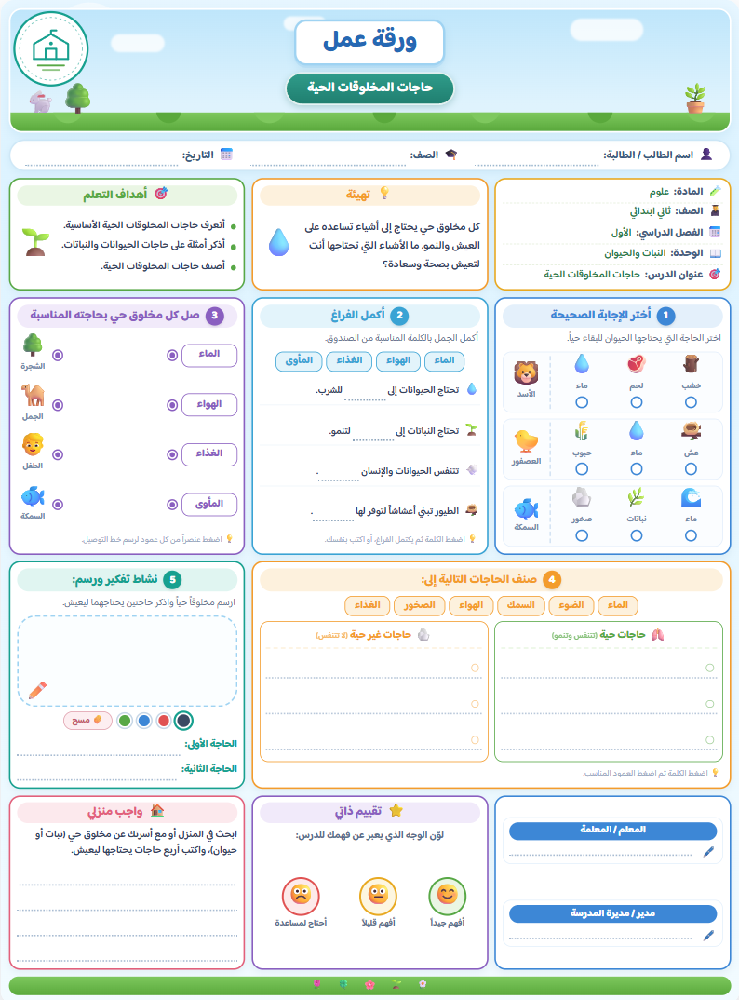 | 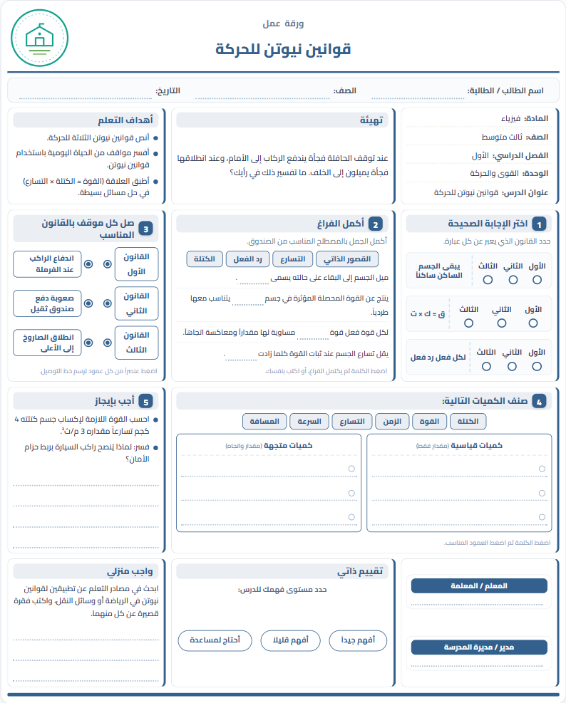 |
|---|---|

### Interactive review cards

| 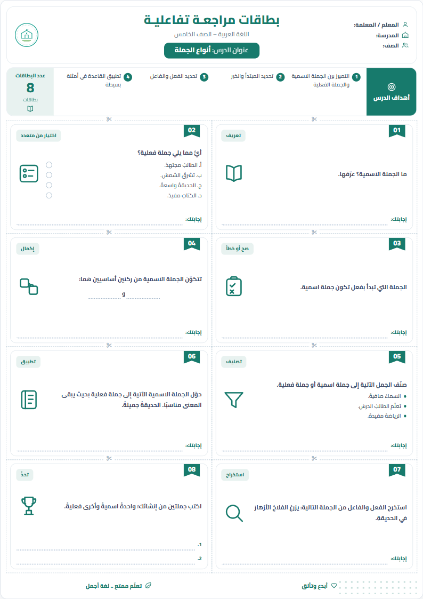 | 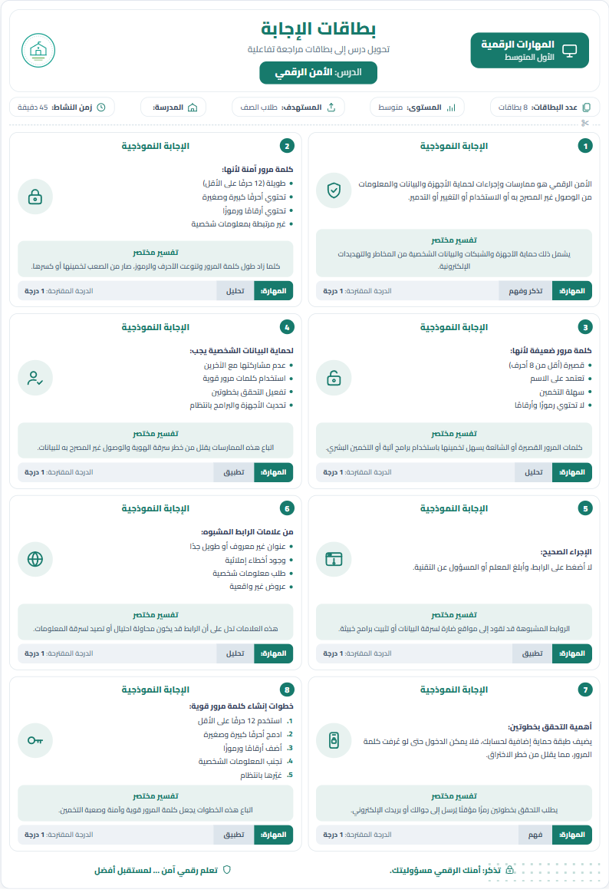 |
|---|---|
| `interactive-card` — pro | `interactive-card-answers` — pro |

| 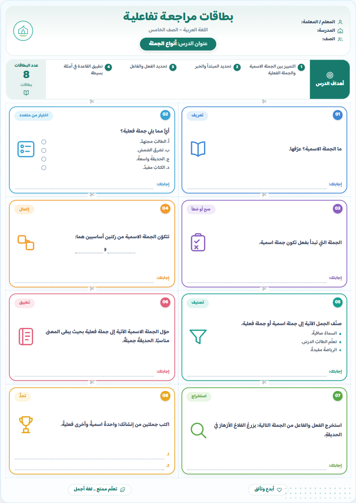 |
|---|
| the same JSON with `age: "kid"` |

### Differentiated lesson plan

| 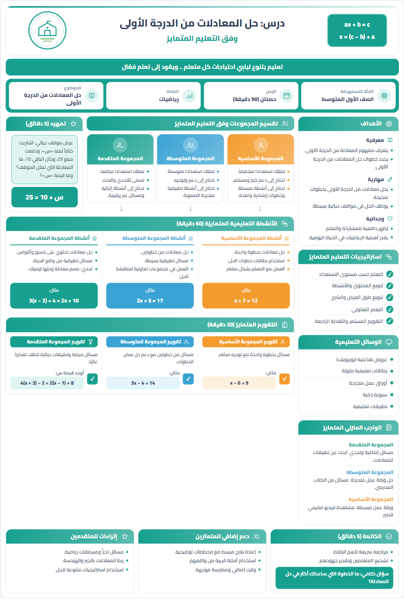 | 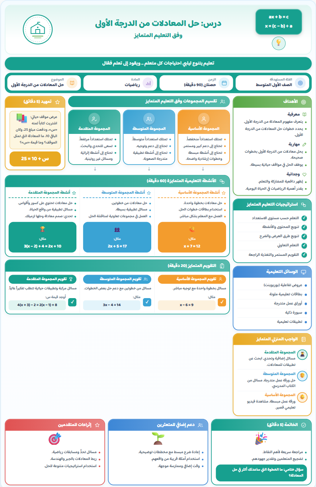 |
|---|---|
| `differentiated-lesson` — pro | the same JSON with `age: "kid"` |

### Golden-minutes card

| 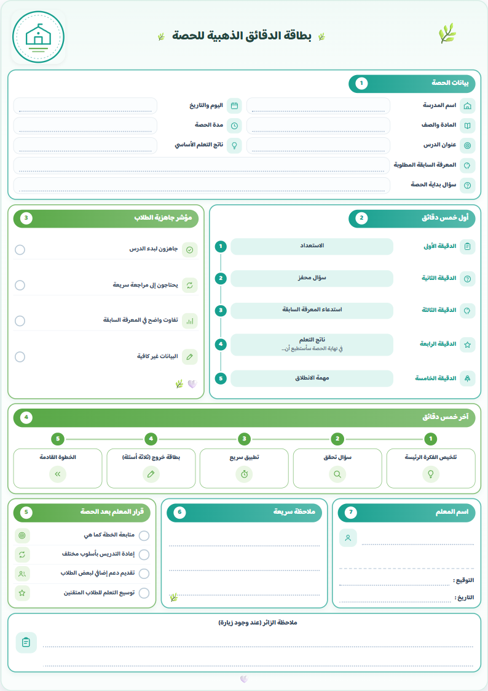 | 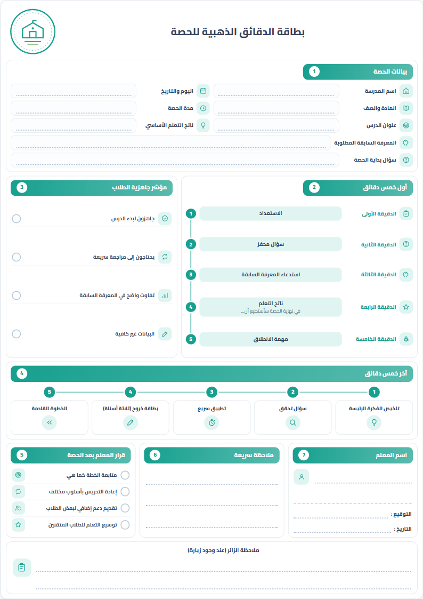 |
|---|---|
| `golden-minutes` — kid | the same JSON with `age: "pro"` |

### Learning-styles survey

| 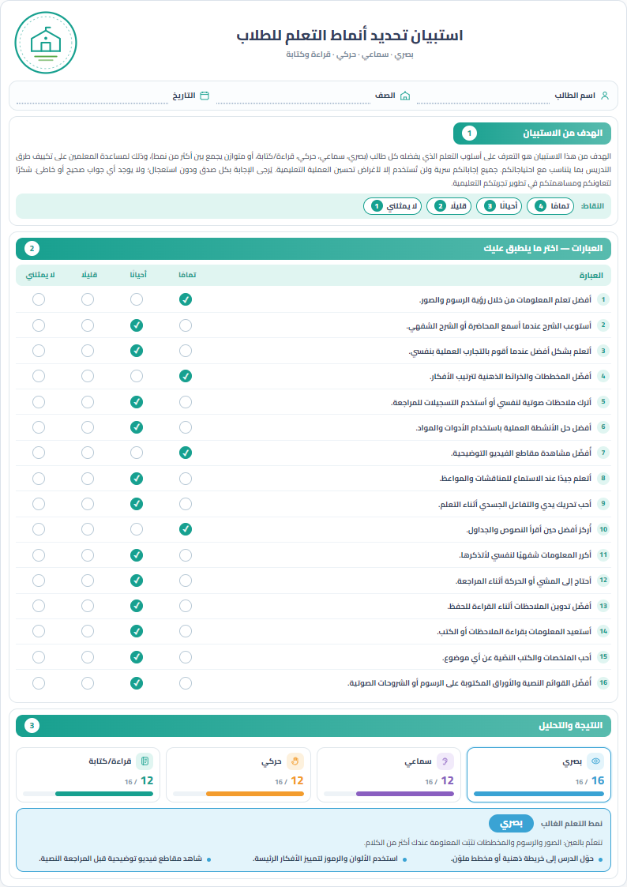 | 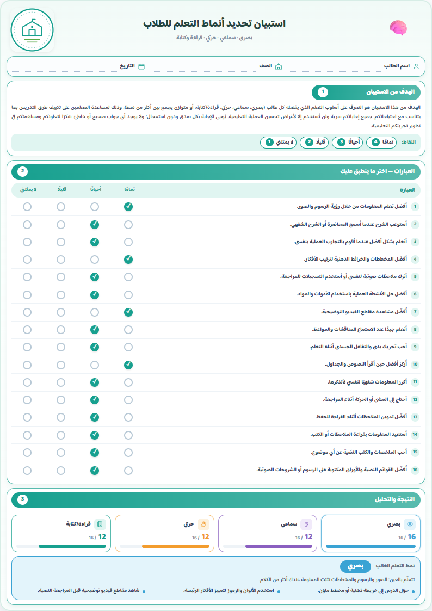 |
|---|---|
| `learning-pattern` — pro | the same JSON with `age: "kid"` |

A question sheet like any other: the statements are ticked on screen or on paper, and the scoring —
points per style, the dominant style, the advice — happens on the server when it is submitted.

*(The previews above still show the earlier self-marking layout, with a result block on the sheet.
That block was removed: a sheet no longer carries its own marking. See
[TEMPLATES.md](docs/TEMPLATES.md#learning-styles-survey).)*

→ [TEMPLATES.md](docs/TEMPLATES.md) for the detail · [JSON.md](docs/JSON.md) to author one.

---

## The two APIs

**The render API** takes JSON and gives you a page. It needs no database and no lesson id, and it is
the whole product if you already have your content somewhere else.

```bash
POST /api/render      { …core-template JSON… }   →  the finished HTML page
POST /api/validate    { …core-template JSON… }   →  { valid, template, errors, warnings }
POST /api/sheets      { …core-template JSON… }   →  { url, embedUrl }   (store once, share the link)
```

**The pipeline** takes a `document_idx` and a seed, reads the lesson, and returns the URL of a
finished, cached page — then, optionally, issues it to a student, grades what comes back and
reports on it.

```bash
POST /api/pipeline/document   { type, document_idx, seed,
                                exam_date, school, teacher }         →  { url, … }
POST /api/pipeline/assign     { …, student_id }                       →  { answer_url, report_url }
POST /api/pipeline/batch      { …, students: [ … ] }                  →  { links: [ { exam_url, … } ] }
POST /api/pipeline/submit     { assignment_id, token, answers }
GET  /api/pipeline/group/<id>/dashboard                               →  the whole class, one page
```

Secrets live in `.env` (copy [`env.example`](env.example)); page links are HMAC-signed.

**Everything it produces is stored.** Two databases on one MongoDB server: the generator's lessons,
read only; and this platform's own — every document generated and the answer key it carries, every
link handed out and the status it is in, every answer, mark and analysis that comes back.

```bash
npm run store:check    # can this connection read AND write? run this first
npm run store:stats    # what is in there
```

**No roster is stored.** Schools, teachers, classes and students belong to the platform that calls
this one: they arrive as parameters — `school`, `teacher`, `student_id`, `exam_date` — and are kept
as snapshots on what we issue, printed into the header rows that are otherwise left blank, so a
sheet handed out last term keeps the name that was printed on it.

→ [API.md](docs/API.md) · [PIPELINE.md](docs/PIPELINE.md) · [DATABASE.md](docs/DATABASE.md)

---

## What is where

```
index.html            the app shell
embed.html            the iframe entry point
config.js             the ONE file you edit per environment
assets/
  css/                base · layout · sections · one file per template · themes · print · present
  js/
    templates/        one module per template  (render · wire · reset · slides)
    sections/         one module per activity type inside a worksheet
    answer.js         turns an issued sheet into a submission
    present.js        board / projector mode
server/
  server.mjs          the core HTTP server: static files + the render API
  render-page.mjs     core-template JSON → one self-contained HTML page
  pipeline/           lesson → document → page → answer sheet → analysis
    build/            one module per document type
    answers/          issue · grade · analyse · profile · deliver · report · group
    mongo/            a small BSON + OP_MSG + SCRAM client (no npm dependencies)
  store/              everything the platform remembers, in MongoDB
    collections.mjs   the collections and their indexes; read this first
    *.mjs             one module per area, the only code that writes queries
data/lessons/         the bundled lessons, one JSON per sheet
docs/                 this documentation
tools/                lesson packer, Postman collection generators, store CLI
```

→ [EXTENDING.md](docs/EXTENDING.md) for the annotated version.

---

## Scripts

```bash
npm start                     # the server
npm run dev                   # the server, restarted on change
npm run health                # GET /api/health

npm run store:check           # can this connection read AND write? run this first
npm run store:indexes         # declare the indexes the collections need
npm run store:stats           # document counts per collection
npm run store:import          # pull data/assignments and data/output into MongoDB

npm run pack-lessons          # encrypt data/lessons/*.json → .wsx (content protection)
npm run make-postman          # regenerate the render-API Postman collection
npm run make-pipeline-postman # regenerate the pipeline Postman collection
npm run docker:up / :down / :logs
```

---

## License and content

The engine is yours to deploy. The bundled lessons are examples — replace them. The learning-styles
instrument in `data/lessons/learning-pattern-survey.json` is a standard VARK-style questionnaire;
check it against your own institution's guidance before using it on students.
