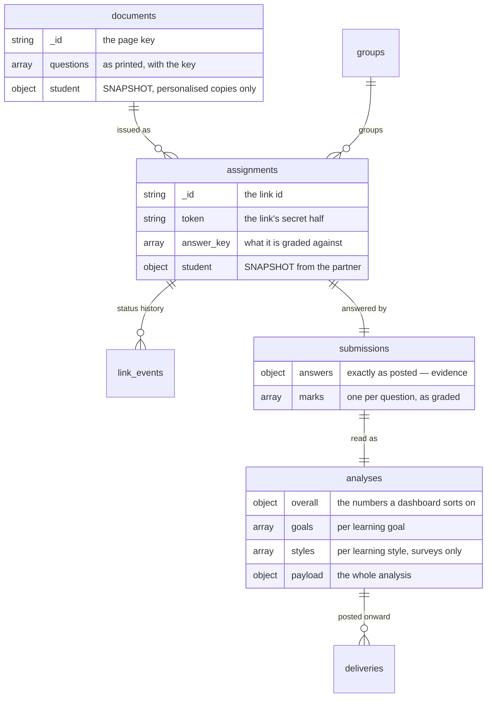

# The database

[← README](../README.md) · [Lifecycle](LIFECYCLE.md) · [Templates](TEMPLATES.md) · [JSON](JSON.md) · [Render API](API.md) · [Pipeline](PIPELINE.md) · [Database](DATABASE.md) · [Deploy](DEPLOY.md) · [Extending](EXTENDING.md)

One MongoDB server, **two databases**, and the difference between them is the
whole design:

| | | |
|---|---|---|
| **`ai`** | the generator's lessons — `questions`, `worksheets`, `summaries` | **read only** |
| **`activities`** | every document this platform generates, every link it hands out, every answer that comes back | **read / write** |

Splitting them is what lets one Mongo user hold `read` on the first and
`readWrite` on the second, so a bug in this code cannot damage the generator's
output. One connection serves both — the same socket, two `$db` values.

---

## What is *not* stored, and why

**There is no roster here.** No `schools`, no `teachers`, no `classrooms`, no
`students`.

Those belong to the platform that calls this one. They arrive as parameters on
the request that asks for a sheet, and they are kept as **snapshots** embedded
on the records below:

```json
{
  "student": { "id": "STU-1042", "name": "أحمد بن سالم", "classroom": "الخامس/ب" },
  "school":  { "id": "SCH-19", "name": "ثانوية الأمير محمد" },
  "teacher": { "id": "T-7", "name": "أ. سارة الحارثي" }
}
```

That is not a shortcut — it is the correct record. A sheet issued last term must
keep the name that was printed on it after the student is renamed, moved to
another class, or removed altogether. A foreign key would rewrite history; a
snapshot cannot. And a roster this system does not own is a roster it cannot
keep true.

So: nothing here is the authority on who anyone is. It is the authority on what
was generated, who it was handed to, and what came back.

---

## Getting started

```bash
npm run store:check      # can this connection read AND write? run this first
npm run store:indexes    # declare the indexes (the server also does this on boot)
npm run store:stats      # document counts, per collection
npm run store:import     # pull data/assignments and data/output in, if upgrading
```

There is no "create the database" step — Mongo makes it on the first insert,
provided the user has `readWrite`.

| Variable | Default | What it does |
|---|---|---|
| `EDU_PIPELINE_MONGO_URI` | *required* | the connection, for both databases |
| `EDU_PIPELINE_DB` | `ai` | the generator's lessons, read only |
| `EDU_STORE_DB` | `activities` | ours, read/write |
| `EDU_STORE` | `1` | `0` = build and serve pages, store nothing |

### The user this needs

```js
use admin
db.createUser({
  user: "edu-app",
  pwd:  "<generate a long one>",
  roles: [
    { role: "readWrite", db: "activities" },
    { role: "read",      db: "ai" }
  ]
})
```

Granting it to a user that already exists:

```js
db.grantRolesToUser("edu-app", [ { role: "readWrite", db: "activities" } ])
```

> **`store:check` attempts a real write**, and that is deliberate. A user with
> `read` where `readWrite` was meant connects perfectly, passes a ping, serves
> pages — and then refuses every submission. Finding that out from a student's
> failed exam is the worst possible time.

---

## Shape of the whole thing



Read it as four stages, in the order the product moves through them:

| Stage | Collections | The question it answers |
|---|---|---|
| **Generation** | `documents` | what was produced, and what was on it |
| **Distribution** | `groups` `assignments` `link_events` | who got it, and what happened to their link |
| **Results** | `submissions` `analyses` | what they answered, and what it means |
| *Operations* | `deliveries` `audit_log` | what the system did about it |

---

## Generation

### `documents`

One record per **built** sheet: a worksheet, a card deck, an answer key, a
lesson plan, a survey.

```js
{
  _id: "worksheet-43617-7-a88883d1b0",   // the page key, derived from the request
  type: "worksheet",
  document_idx: "43617",                 // the lesson, in the `ai` database
  lesson_title: "النثر السعودي 2- فن المقالة",
  title: "ورقة عمل — فن المقالة",
  subject: "arabic",
  seed: "7",
  scoring: "mastery",                    // mastery | profile | none
  theme: null, color: "#177a6c",
  counts: { multiple_choice: 4, true_false: 3 },
  request: { },                          // the canonical build request

  student: null,                         // SNAPSHOT, or null for a classroom copy
  school: { id: "SCH-19", name: "…" },   // SNAPSHOT, when the request named one
  exam_date: { iso: "2026-11-02", text: "٢ نوفمبر ٢٠٢٦" },

  questions: [                           // THE EXAM AS PRINTED, with its key
    { question_id: "mc_1", position: 1, kind: "multiple_choice",
      question: "…", choices: ["…"], answer_key: 1, answer: "…",
      answer_parts: [], difficulty: 2, goal_id: "goal_1", goal_text: "…",
      style: null, max_points: null }
  ],
  goals: [ ],
  question_count: 13, goal_count: 5,

  cache_version: "5", bytes: 48210, page_url: "https://…/t/…",
  built_by: null,                        // teacher snapshot, when the caller named one
  built_at: "…", last_served_at: "…", serve_count: 12, rebuild_count: 0,
  status: "built",                       // built | evicted | deleted
  created_at: "…", updated_at: "…"
}
```

- **`_id` is the page key**, which is derived from the request — so rebuilding
  the same document updates one record and bumps `rebuild_count` instead of
  growing the collection.
- The HTML stays on disk in the page cache. This is the *record*, and the two do
  not share a lifetime: a cached page is evicted when the directory outgrows its
  limit, and "which exam did we give in October, and what was on it" has to
  survive that.
- `questions[]` is embedded because it is written once, read whole, and never
  queried across documents. The lesson can be regenerated or edited afterwards
  and this stays true to the paper the student held.

---

## Distribution

### `groups`

One sitting: a class, a lesson, a day. `_id` is the `group_id` the API already
accepts (`lesson-43617-oct`) — a teacher names it, so it is a string key.

```js
{
  _id: "lesson-43617-oct",
  name: "الخامس/ب — النثر السعودي",
  document_idx: "43617", type: "worksheet", seed: "7",
  exam_date: { iso: "2026-10-05", text: "…" },
  classroom: { }, school: { }, teacher: { },   // SNAPSHOTS, when the caller sent them
  status: "open",                         // open | closed
  closed_at: null, closed_reason: "",
  created_at: "…", updated_at: "…"
}
```

Created by the first sheet filed under it — nobody has to create a group before
issuing into one. Its open/closed state is the only thing here we own.

### `assignments` — the link itself

One record per sheet handed to one student, once.

```js
{
  _id: "kaWtCYJCM6F2f4ddzl7buA",         // appears in /a/<id>
  token: "…",                            // the link's secret half
  status: "issued",                      // issued | submitted | revoked | expired

  group_id: "lesson-43617-oct",
  document_id: "worksheet-43617-7-…",    // the page key
  document_idx: "43617",

  student: { id: "STU-1042", name: "…", classroom: "…", section: "" },   // SNAPSHOT
  group:   { id: "lesson-43617-oct", name: "…" },                        // SNAPSHOT
  school:  { id: "SCH-19", name: "ثانوية الأمير محمد" },                  // SNAPSHOT
  teacher: { id: "T-7", name: "أ. سارة الحارثي" },                        // SNAPSHOT

  lesson_title: "…", title: "…", type: "worksheet", scoring: "mastery",
  seed: 7, exam_date: { },

  answer_key: [ ],                       // the rows it is graded against
  goals: [ ],
  profile: null,                         // the survey instrument, when scoring is "profile"
  request: { },                          // so the page can be rebuilt
  question_count: 13, goal_count: 5,

  attempts: 1,
  created_at: "…", expires_at: null, opened_at: "…",
  submitted_at: null, revoked_at: null, revoked_reason: "",
  updated_at: "…"
}
```

**This collection holds the answer key and the link token.** It is the reason
the Mongo user for this database should not be handed to anything that only
needs to read results.

The lifecycle only ever moves forward:

```
issued ──open──▶ issued ──submit──▶ submitted     (link dead)
   └──────────revoke / expire─────▶ revoked / expired
```

Nothing reopens a dead link. "Give the student another go" means issuing a *new*
assignment, which mints a new id and a new token — so an old link that leaks is
worth nothing, and every attempt is its own record with its own result instead
of one record quietly overwritten.

### `link_events` — the status history

```js
{ _id: "lev_…", assignment_id: "…", event: "blocked",
  status_before: "submitted", status_after: "submitted",
  reason: "already-submitted", ip: "…", user_agent: "…",
  detail: null, at: "…" }
```

`event` is `issued` | `opened` | `submitted` | `revoked` | `expired` |
`blocked` | `rebuilt`. **`blocked` is a refused attempt to open a dead link**,
with the reason — `bad-token`, `already-submitted`, `expired`.

The `assignments` record says where a link **is**; this says how it got there,
which is the question actually asked when a student says "it did not work".

---

## Results

Two collections, deliberately separate. `submissions.answers` is **evidence**
and is never rewritten; everything in `analyses` is **interpretation** and is
rewritten whole by a re-grade, which bumps `revision`. Keeping them in one
document would make "re-grade last term with the corrected answer key" a
data-loss operation, and that is the one operation this split exists for.

### `submissions`

```js
{
  _id: "sub_…",
  assignment_id: "…",                    // unique — a link is single-use
  document_id: "…", document_idx: "43617",
  student: { },  group_id: "…",  group: { },        // SNAPSHOTS
  school: { },  teacher: { },  exam_date: { },      // …and the sitting they were sat in

  answers: { "mc_1": "الجملة الاسمية", "tf_1": "خطأ" },   // exactly as posted
  answer_count: 13,
  unmatched: [],                         // answers for questions not on the sheet

  marks: [                               // one per question, as graded
    { question_id: "mc_1", position: 1, kind: "multiple_choice",
      goal_id: "goal_1", student_answer: "…", correct_answer: "…",
      chosen_index: 1, answered: true, correct: true,
      score: 1, confidence: "exact", needs_review: false,
      points: null, max_points: null, chosen_label: "", style: null, detail: "" }
  ],

  source: "web", duration_sec: 812, ip: "…", user_agent: "…",
  submitted_at: "…", created_at: "…"
}
```

`marks[].score` carries partial credit (0–1): blanks half-filled, short answers
half-right. `needs_review` flags what automatic grading is not confident about,
rather than quietly counting it. `points` / `max_points` / `style` are the
survey fields — a scale point has no right answer, only a weight and a style.

### `analyses`

```js
{
  _id: "ana_…",
  submission_id: "…", assignment_id: "…",      // unique per assignment
  document_id: "…", document_idx: "43617",
  student: { }, group_id: "…", group: { },      // SNAPSHOTS
  school: { }, teacher: { }, exam_date: { },    // …and the sitting they were sat in
  lesson_title: "…", type: "worksheet",
  scoring: "mastery",                           // mastery | profile

  overall: { total: 13, correct: 3, wrong: 10, unanswered: 0,
             needs_review: 2, percentage: 23.1, score: 3.5,
             score_percentage: 26.9, points: null, max_points: null,
             mastery: "not-met", mastery_label: "لم يتحقق" },

  goals: [                                      // per learning goal
    { goal_id: "goal_1", goal_text: "…", cognitive_level: "فهم",
      priority: 1, position: 0, total: 3, correct: 2, wrong: 1,
      unanswered: 0, needs_review: 0, percentage: 66.7, score: 2,
      mastery: "developing", mastery_label: "مقبول",
      recommendation: "…", question_ids: ["mc_1", "tf_1", "cp_1"] }
  ],

  styles: null,                                 // surveys only — see below
  profile_verdict: null,

  report: { headline, verdict, summary, lines, strengths, needs_work, next_steps },
  payload: { },                                 // the whole analysis, as served

  revision: 1,                                  // bumped by a re-grade
  submitted_at: "…", created_at: "…", updated_at: "…"
}
```

`payload` is the complete analysis object as it is served, saved and posted
onward. The fields beside it are an **index over it**, not a second copy: they
exist so a dashboard can sort forty students by percentage without pulling forty
full analyses back.

**`goals[].percentage: null` means the goal went untested** — the sheet never
reached it. That is a different fact from scoring zero, and the shape says so.

A survey fills `styles[]` instead, which is where an exam has goals — kept in
its own field so the two are never averaged together by accident:

```js
styles: [
  { style_key: "visual", label: "بصري", points: 12, max_points: 16,
    percentage: 75, strength: "proficient", strength_label: "جيد جداً",
    is_dominant: true, position: 0, color: "#…", description: "…", tips: [ ] }
]
```

---

## Operations

### `deliveries`

Every POST to the partner's backend, successful or not.

```js
{ _id: "dlv_…", analysis_id: "…", assignment_id: "…",
  kind: "analysis",                      // submit | analysis
  endpoint: "https://…", ok: false, status_code: 502,
  duration_ms: 8004, error: "timed out after 8000ms", response: "",
  attempt: 1, attempted_at: "…" }
```

A failed delivery is a record here and a submission that still succeeded — the
only acceptable order of those two facts. `results.failedDeliveries()` is the
replay list, grouped so an endpoint that eventually accepted a result stops
appearing.

### `audit_log`

```js
{ _id: "aud_…", at: "…", actor_type: "api", actor_id: "", actor: null,
  action: "document.build", entity_type: "documents", entity_id: "worksheet-…",
  ip: "", detail: { type: "worksheet", document_idx: "43617", seed: 7 } }
```

Deliberately generic. A collection per action would be twenty collections nobody
queries; the question actually asked is always "what happened to *this* thing",
which is one index on `(entity_type, entity_id)`.

---

## Indexes

Declared in [`server/store/collections.mjs`](../server/store/collections.mjs)
and applied on boot — idempotent, so it costs one round trip after the first
time. `npm run store:indexes` does it by hand.

| Collection | Index | For |
|---|---|---|
| `documents` | `{document_idx, type}` · `{built_at:-1}` · `{"student.id"}` | the catalogue, the admin list |
| `assignments` | `{group_id, status}` · `{"student.id", created_at:-1}` · `{document_idx, created_at:-1}` · `{status, created_at:-1}` · `{expires_at}` | the dashboard, the link board, the expiry sweep |
| `link_events` | `{assignment_id, at}` · `{at:-1}` | one link's history |
| `submissions` | `{assignment_id}` **unique** · `{"student.id", submitted_at:-1}` · `{group_id, submitted_at:-1}` | the rule that a link is single-use |
| `analyses` | `{assignment_id}` **unique** · `{group_id, created_at:-1}` · `{"student.id", created_at:-1}` · `{document_idx, created_at:-1}` | the roll-ups |
| `groups` | `{document_idx}` · `{updated_at:-1}` | the group index |
| `deliveries` | `{analysis_id}` · `{ok, attempted_at:-1}` | the replay list |
| `audit_log` | `{entity_type, entity_id, at:-1}` · `{at:-1}` | "what happened to this" |

The two `unique` indexes are **rules, not optimisations**: one submission and
one analysis per assignment. A second could only be a bug, and a re-grade
replaces rather than appends.

---

## What writes what

| When | What is written |
|---|---|
| A document is built (`POST /api/pipeline/document`) | `documents` (+ its `questions[]`), `audit_log` |
| A page is served (`GET /t/<key>`) | `documents.serve_count`, `last_served_at` |
| A sheet is issued (`/assign`, `/batch`, `?student_id=`) | `assignments`, `link_events`, and `groups` if the sitting is new |
| A student opens `/a/<id>` | `assignments.attempts` / `opened_at`, `link_events` |
| A dead link is clicked | `link_events` (`blocked`, with the reason) |
| A sheet is submitted | `assignments.status`, `submissions` (+ `marks[]`), `analyses` (+ `goals[]` / `styles[]`), `link_events` |
| The backend is POSTed to | `deliveries` |
| A link is revoked, a sitting closed | `assignments` / `groups`, `link_events` |

Nothing writes to `ai`. Ever.

---

## Reading it over HTTP

Read-only, behind the API key like the rest of `/api/pipeline`:

```
GET /api/pipeline/store                       counts per collection + a live access check
GET /api/pipeline/documents                   every sheet generated so far
GET /api/pipeline/documents/:key/questions    its questions and answer key
GET /api/pipeline/links                       every issued link and its status
GET /api/pipeline/students/:id/results        one student's history
GET /api/pipeline/analytics/questions         which item was got wrong
GET /api/pipeline/analytics/goals?group_id=   what to reteach
```

There are no roster endpoints, for the reason at the top of this page. A student
id in a URL is the *partner platform's* id; what comes back is the results filed
under it, not a student record.

---

## Upgrading from the file-based store

Before this, issued links were JSON files under `EDU_PIPELINE_ASSIGN_DIR` and
results were JSON files under `EDU_PIPELINE_OUTPUT_DIR`. Both are still readable:

```bash
npm run store:import
```

Safe to run twice — every write is keyed on the id the file carries, so a second
run updates rather than duplicates. The files are left where they are; delete
them once you are satisfied.

The output directory keeps getting a readable copy of every result
(`EDU_PIPELINE_SAVE_RESULTS=0` stops it). MongoDB is the store; the files are a
convenience.

---

## The code

| File | What it is |
|---|---|
| [`server/store/collections.mjs`](../server/store/collections.mjs) | the collection names and their indexes — read this first |
| [`server/store/index.mjs`](../server/store/index.mjs) | the shared connection, the index setup, the access check |
| [`server/store/documents.mjs`](../server/store/documents.mjs) | generated sheets |
| [`server/store/assignments.mjs`](../server/store/assignments.mjs) | links, sittings, status history |
| [`server/store/results.mjs`](../server/store/results.mjs) | submissions, analyses, deliveries |
| [`server/store/audit.mjs`](../server/store/audit.mjs) | the audit log |
| [`server/pipeline/mongo/client.mjs`](../server/pipeline/mongo/client.mjs) | the driver: OP_MSG over TCP, SCRAM auth, read and write. No npm dependencies |

Those four repository modules are the only code in the project that builds a
Mongo query. Everything above them passes whole objects around — an assignment
record, an analysis — and never a filter or a projection.
