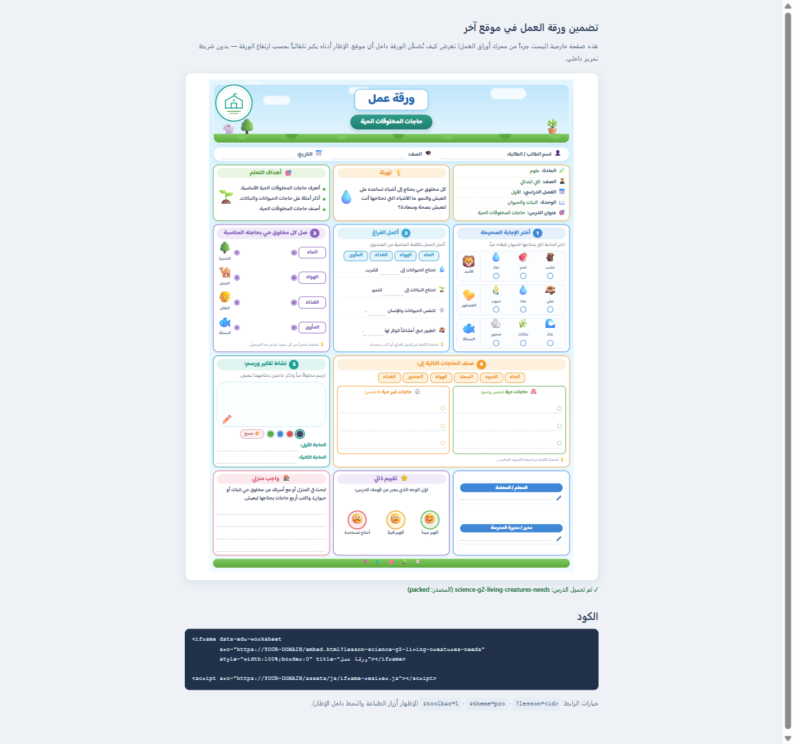

# Deploying it

[← README](../README.md) · [Lifecycle](LIFECYCLE.md) · [Templates](TEMPLATES.md) · [JSON](JSON.md) · [Render API](API.md) · [Pipeline](PIPELINE.md) · [Database](DATABASE.md) · [Deploy](DEPLOY.md) · [Extending](EXTENDING.md)

Docker, the environment, the logo, embedding, and how much a sheet can be protected.

For the quick local start, see the [README](../README.md#quick-start). This page is what changes
when it stops being local.

---

## Run with Docker

The image is Node + this source tree — no build step, no npm install, nothing to compile.

```bash
cp env.example .env               # compose reads this file; without it it refuses to start
docker compose up -d              # build + start in the background
docker compose logs -f            # follow the logs
docker compose down               # stop and remove
```

`docker-compose.yml` declares `env_file: .env`, so **that file must exist** — by design, since it is
where `EDU_API_KEY`, `EDU_PIPELINE_MONGO_URI` and `EDU_PIPELINE_PAGE_SECRET` live and it is
gitignored. The pipeline endpoints stay unusable until `EDU_PIPELINE_MONGO_URI` points at a real
server (its placeholder value is not one) or you set `EDU_PIPELINE=0` to switch the extension off.

Check the connection can do both halves of its job before trusting it:

```bash
docker compose exec edu-templates npm run store:check
```

That attempts a real write. A Mongo user with `read` where `readWrite` was meant connects
perfectly, serves pages, and then refuses every submission — see
[DATABASE.md](DATABASE.md) for the user to create.

**The product's memory is in MongoDB, not in these volumes.** Back up the
`EDU_STORE_DB` database (`mongodump --db activities`); the volumes below hold rebuildable output
and a readable copy of each result.

| Volume | Holds | Rebuildable |
|---|---|---|
| `edu-page-cache` | built pages | yes |
| `edu-assignments` | pre-database issued links, if any | no — `store:import` moves them in |
| `edu-output` | result JSON and report pages | no (but MongoDB has them too) |

…or without compose:

```bash
docker build -t edu-templates .
docker run -d --name edu-templates -p 8138:8138 --env-file .env edu-templates
```

The container answers `GET /api/health`, which is also its Docker `HEALTHCHECK` — `docker ps` shows
`healthy` once the server is up.

### Configuration

Everything is environment variables; nothing needs a rebuild. With compose, put them in **`.env`** —
a variable exported in your shell is only used to interpolate `${…}` in
[docker-compose.yml](../docker-compose.yml) and does *not* reach the container. With `docker run`, use
`--env-file .env` or `-e`.

| Variable | Default | What it does |
|---|---|---|
| `PORT` | `8138` | port inside the container |
| `EDU_PUBLIC_PORT` | `8138` | host port compose publishes (compose only) |
| `EDU_HOST` | `0.0.0.0` | bind address |
| `EDU_API_KEY` | *(unset)* | when set, `/api/*` and `/s/*` need `X-Api-Key: <it>` — [four paths stay open](API.md#authentication) |
| `EDU_CORS_ORIGIN` | `*` | `Access-Control-Allow-Origin` — pin it to your site in production |
| `EDU_MAX_BODY` | `4000000` | request body ceiling, bytes |
| `EDU_SHEET_TTL_MIN` | `1440` | how long a stored sheet (`POST /api/sheets`) lives |
| `EDU_MAX_SHEETS` | `500` | how many stored sheets to keep in memory |

`EDU_PUBLIC_PORT` is the exception: compose reads it while parsing the file, so it works from the
shell as well as from `.env`.

```bash
# publish on :80…
EDU_PUBLIC_PORT=80 docker compose up -d

# …and require an API key — this one has to be in .env, not on the command line
echo 'EDU_API_KEY=s3cret' >> .env && docker compose up -d
```

The extension's own settings (`EDU_PIPELINE_*` — MongoDB, the page-signing secret, where results go)
and the store's two (`EDU_STORE`, `EDU_STORE_DB`) are documented in
**[docs/PIPELINE.md → Configuration](PIPELINE.md#configuration)** and
**[docs/DATABASE.md](DATABASE.md)**, and listed with comments in [`env.example`](../env.example).

> **The Mongo user needs two roles**: `read` on the generator's lessons database and `readWrite`
> on `EDU_STORE_DB`. One connection, two databases — so a bug in this code cannot damage the
> generator's output.

### Authoring lessons against the container

Lessons are baked into the image. To edit them on the host and just reload the browser, uncomment
the volume in `docker-compose.yml`:

```yaml
volumes:
  - ./data/lessons:/app/data/lessons:ro
```

Then `docker compose up -d` once, and every new `data/lessons/<id>.json` is live at
`?lesson=<id>` with no rebuild.

> **Behind a reverse proxy**, forward `X-Forwarded-Proto` and `X-Forwarded-Host` — the API builds
> the `url` / `embedUrl` it returns from those headers.

---

---

## The school logo

Every sheet shows the school logo in a **fixed place**, and the logo comes from **one place**:

```jsonc
// config.js
logo: {
  src: "assets/img/logo.png",   // replace this file with your real logo — done
  width: 84                            // px — worksheet stamp / golden-minutes badge box
}
```

Where each template puts it:

| Template | Fixed logo spot |
|---|---|
| `golden-minutes` | the masthead badge box (top corner) |
| `interactive-card` / `…-answers` | the masthead logo slot (was the dashed شعار box) |
| `differentiated-lesson` | the masthead corner (the art side) |
| `worksheet` | a stamp pinned to the sheet's top-left corner |

`src` accepts a path, a full URL, an emoji, or a built-in icon name; `src: ""` turns the logo off
site-wide. A lesson can override per sheet with `meta.logo` — its own image wins, and
`"logo": ""` hides the logo on that sheet only (the golden-minutes card then falls back to its
JSON `meta.badge`). The render API mirrors the same setting via the `logo` option.

### Region- and institution-neutral by design

The engine names **nobody**: no school, no person, no city, no country, no ministry or authority,
no currency, and no national curriculum. Sample lessons ship with those fields blank, the shipped
logo is a generic placeholder crest, and every default label is written in neutral Arabic that
reads the same in Egypt, the Gulf, the Levant or North Africa. Everything institution-specific is
**yours to fill in**, per deployment or per sheet:

| Want to show | Put it in |
|---|---|
| your school / organization logo | `config.js` → `logo.src` (once, every template) |
| a school / district / authority name on a sheet | `meta.org` (golden-minutes) or an `info` / `identity` row |
| teacher, principal, class, date | the sheet's own fields — all blank by default |

Currency, calendar and grade names are never hardcoded: write them as plain text in your lesson
JSON and they render exactly as typed.

---

---

## Embedding in another site

```html
<iframe data-edu-worksheet
        src="https://your-domain/embed.html?lesson=science-g1-plant-parts"
        style="width:100%;border:0" title="ورقة عمل"></iframe>

<script src="https://your-domain/assets/js/iframe-resizer.js"></script>
```

`embed.html` renders the identical worksheet with the outer page background, padding and shadow
removed, and the toolbar hidden (add `&toolbar=1` to bring it back). The resizer script grows the
iframe to the worksheet's real height, so there is never an inner scrollbar.

A runnable copy of exactly that host page ships with the project — start the server and open
**`/examples/embed-example.html`**:



*The blue-grey page is the host site; the white sheet inside it is the iframe. The green line under
the frame is the host reacting to the worksheet's own `edu:ready` event.*

The frame also posts messages to the host — listen for them directly, or use the DOM events the
resizer dispatches on the `<iframe>`:

```js
document.addEventListener("edu:ready", e => console.log(e.detail.lessonId, e.detail.from));
document.addEventListener("edu:error", e => console.log(e.detail.code));
```

| Message | Payload |
|---|---|
| `height` | `{ height, lessonId }` — sent whenever the worksheet resizes |
| `ready`  | `{ lessonId, from }` — `from` is `api` \| `static` \| `packed` \| `src` \| `inline` \| `inline-global` |
| `error`  | `{ code, message }` |

The host can also send `{ source: "edu-host", type: "hello" }` to make the frame re-announce its
state — the resizer does this automatically, so script order never matters.

---

---

## Content protection

Worksheets are the product, so the engine ships with layered anti-cloning measures, all configured
by the `protection` block in `config.js`:

```js
protection: {
  enabled: true,
  allowedHosts: ["example.com"],     // exact host or any subdomain; [] = any host
  allowLocalhost: true,              // keep local dev working
  blockFileProtocol: true,           // kill "Save page as…" copies opened from disk
  embedOnly: false,                  // true = refuse to render outside an <iframe>
  homeUrl: "https://example.com",    // escape link on the block screen
  deterrents: "embed",               // right-click/copy blocking: true | false | "embed"
  packedLessons: true                // serve encrypted .wsx instead of readable .json
}
```

**What each layer stops**

| Layer | Attack it stops |
|---|---|
| `guard.js` (file/domain lock) | saving the page and opening it from disk, or re-hosting the files on another domain — the copy wipes itself and shows a block screen |
| packed lessons (`.wsx`) | downloading `data/lessons/*.json` directly, or reading the worksheet JSON in the network tab — lessons travel as AES-encrypted binary |
| deterrents (`protect.js`) | casual right-click → save, select-all → copy of the worksheet text (answer inputs still work; printing stays enabled — it's a worksheet) |

`guard.js` is deliberately a classic script, not a module: browsers refuse to run modules from
`file://`, so only a classic script still executes inside a saved copy — exactly where it must fire.

**Deploying with packed lessons**

```bash
node tools/pack-lessons.mjs        # data/lessons/*.json → data/lessons/*.wsx
```

then upload the `.wsx` files **without** the plain `.json` files (keep the JSON in git — it is the
editable source), and set `packedLessons: true`. After editing any lesson, re-run the script —
otherwise the site keeps serving the stale `.wsx`. If a `.wsx` is missing the engine falls back to
the plain JSON file, so local dev works before packing. WebCrypto needs a secure context: HTTPS in
production, `localhost` in dev.

**Be honest about the limits.** Anything a browser can display can be extracted by a determined
person — devtools, print-to-PDF, screenshots, or reading `pack.js` to find the decryption seed.
These layers stop *casual* cloning (save the file, grab the JSON, re-host it), which is the
realistic threat. The only real access control is **API mode**: set `apiBase` to a backend that
checks a session/token before returning a lesson, disable `fallbackToStatic`, and don't deploy the
`data/lessons/` folder at all. Then the content simply is not on the static host to steal.

---
