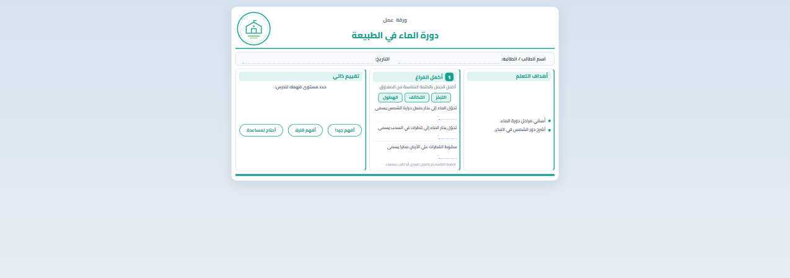

# The JSON reference

[← README](../README.md) · [Lifecycle](LIFECYCLE.md) · [Templates](TEMPLATES.md) · [JSON](JSON.md) · [Render API](API.md) · [Pipeline](PIPELINE.md) · [Database](DATABASE.md) · [Deploy](DEPLOY.md) · [Extending](EXTENDING.md)

Everything a sheet is, is in its JSON. This page is every field of every template.

Start with [a worked example](#a-worked-example) if you have not written one before, then jump to
your template:

[`worksheet`](#worksheet) · [`interactive-card`](#interactive-card) ·
[`interactive-card-answers`](#interactive-card-answers) ·
[`differentiated-lesson`](#differentiated-lesson) · [`golden-minutes`](#golden-minutes) ·
[`learning-pattern`](#learning-pattern) · [template detection](#template-detection)

---

## A worked example

This is a complete, valid worksheet. Nothing is omitted: `meta` picks the template and the look,
`sections` lists the activities, and every other block is optional.

```json
{
  "meta": {
    "template": "worksheet",
    "age": "pro",
    "color": "teal",
    "badge": "ورقة عمل",
    "title": "دورة الماء في الطبيعة"
  },
  "studentBar": [
    { "icon": "👤", "label": "اسم الطالب / الطالبة" },
    { "icon": "📅", "label": "التاريخ" }
  ],
  "objectives": {
    "title": "أهداف التعلم",
    "items": ["أُسمّي مراحل دورة الماء.", "أشرح دور الشمس في التبخر."]
  },
  "sections": [
    {
      "type": "fill-blank",
      "number": 1,
      "title": "أكمل الفراغ",
      "instruction": "أكمل الجمل بالكلمة المناسبة من الصندوق.",
      "wordBank": ["التبخر", "التكاثف", "الهطول"],
      "items": [
        { "text": "تحوّل الماء إلى بخار بفعل حرارة الشمس يسمى ___." },
        { "text": "تحوّل بخار الماء إلى قطرات في السحب يسمى ___." },
        { "text": "سقوط القطرات على الأرض مطراً يسمى ___." }
      ]
    },
    {
      "type": "self-assessment",
      "title": "تقييم ذاتي",
      "prompt": "حدد مستوى فهمك للدرس:",
      "options": [
        { "icon": "😊", "label": "أفهم جيداً" },
        { "icon": "😐", "label": "أفهم قليلاً" },
        { "icon": "☹️", "label": "أحتاج لمساعدة" }
      ]
    }
  ]
}
```

Save it as `data/lessons/water-cycle.json` and open `index.html?lesson=water-cycle`:



The engine filled in everything the JSON did not say: the masthead, the school logo, the teal
accent applied to every card, the dotted answer lines, the word-bank chips (clickable — tapping one
fills the blank), and the A4 page frame.

### The same JSON, three other ways

```bash
# 1 · the finished page, as a file
curl -X POST http://localhost:8138/api/render \
     -H "Content-Type: application/json" -d @water-cycle.json -o sheet.html

# 2 · a self-contained page — CSS inlined, no server needed to view it
curl -X POST "http://localhost:8138/api/render?standalone=1&interactive=0" \
     -H "Content-Type: application/json" -d @water-cycle.json -o sheet.html

# 3 · store once, share the link
curl -X POST http://localhost:8138/api/sheets \
     -H "Content-Type: application/json" -d @water-cycle.json
# → { "url": "http://localhost:8138/s/EkSxGgUz_22Z", "embedUrl": "…?embed=1", … }
```

Not sure a payload is right? Ask before rendering:

```bash
curl -X POST http://localhost:8138/api/validate \
     -H "Content-Type: application/json" -d @water-cycle.json
# → { "valid": true, "template": "worksheet", "errors": [], "warnings": [] }
```

Switch the look without touching the JSON — `?age=kid` on the URL, `?theme=pro` on the API, or the
🎨 button. Same content, different sheet.

---

---

## Icons & pictures

Every `icon` / `image` / `mascot` / `deco` / decor slot accepts **any** of:

| Value | Rendered as |
|---|---|
| `"puzzle"` — a built-in name | Line-art SVG that inherits the card color |
| `"🦁"` (any other text without `.` or `/`) | The emoji/text itself |
| `"https://…/lion.png"`, `"images/lion.svg"`, `data:` URI | `` tag |
| `""` / missing | Dashed placeholder box 🖼️ |
| A URL that fails to load | Automatically swapped to the placeholder box |

Prototype with emoji, later swap in real PNG/SVG links per lesson — nothing else changes.

In the `pro` age, emoji icons are hidden automatically, but **built-in SVG icons and real image
URLs still display** — a diagram or a pictogram is content, not decoration.

**Built-in icon names** (`assets/js/icons.js`):

`user` `users` `user-check` `school` `id` · `book` `cards` `clipboard` `clipboard-check` `list`
`puzzle` `funnel` `notebook` `search` `trophy` `pencil` `key` `calendar` · `lock` `lock-open`
`shield` `shield-check` `globe` `link-alert` `phone-lock` `computer` · `clock` `timer` `bulb`
`brain` `question` `rocket` `refresh` `next` · `eye` `ear` `hand` · `target` `level` `upload`
`star` `heart` `leaf` `check` `scissors`

---

## `interactive-card`

```jsonc
{
  "meta": {
    "template": "interactive-card",
    "age": "pro",                          // kid | pro
    "color": "#177a6c",                    // hex or palette name
    "badge": "بطاقات مراجعـة تفاعليـة",      // big masthead title
    "subtitle": "اللغة العربية – الصف الخامس",
    "lessonLabel": "عنوان الدرس",
    "lessonTitle": "أنواع الجملة",
    "logo": "",                            // YOUR logo file — image URL or data: URI
    "columns": 2                           // cards per row (default 2)
  },

  // right side of the masthead
  "identity": [
    { "icon": "user",   "label": "المعلم / المعلمة", "value": "" },
    { "icon": "school", "label": "المدرسة",          "value": "" }
  ],

  // the strip under the masthead
  "objectives": { "title": "أهداف الدرس", "icon": "target", "items": ["…", "…"] },
  "counter":    { "label": "عدد البطاقات", "value": "8", "unit": "بطاقات", "icon": "book" },

  "cards": [
    { "number": "01", "tag": "تعريف", "icon": "book",
      "question": "ما الجملة الاسمية؟ عرّفيها." },

    { "number": "02", "tag": "اختيار من متعدد", "icon": "list",
      "question": "أيٌّ مما يلي جملة فعلية؟",
      "options": ["أ. …", "ب. …", "ج. …", "د. …"] },      // clickable radios

    { "number": "05", "tag": "تصنيف", "icon": "funnel",
      "question": "صنّفي الجمل الآتية…",
      "bullets": ["…", "…", "…"] },

    { "number": "04", "tag": "إكمال", "icon": "puzzle",
      "question": "تتكوّن الجملة الاسمية من ركنين هما:",
      "fill": "_____ و _____" },                          // 3+ underscores = typeable blank

    { "number": "08", "tag": "تحدٍّ", "icon": "trophy",
      "question": "اكتبي جملتين…",
      "answerLabel": "",                                  // "" hides the إجابتك label
      "lines": 2, "numbered": true }                      // 1. 2. answer lines
  ],

  "footer": { "items": [ { "icon": "heart", "text": "أبدعي وتألقي" } ] }
}
```

Per-card keys: `number, tag, icon, color, question, options[], bullets[], fill, answerLabel,
lines, numbered`. `question` and `fill` both run through the blank-filler, so any `___` becomes a
typeable blank.

## `interactive-card-answers`

```jsonc
{
  "meta": { "template": "interactive-card-answers", "age": "pro", "color": "#177a6c",
            "badge": "بطاقات الإجابة", "subtitle": "…",
            "lessonLabel": "الدرس", "lessonTitle": "الأمن الرقمي", "logo": "" },

  "subject": { "icon": "computer", "title": "المهارات الرقمية", "subtitle": "الأول المتوسط" },

  "metaBar": [
    { "icon": "cards", "label": "عدد البطاقات", "value": "8 بطاقات" },
    { "icon": "level", "label": "المستوى",      "value": "متوسط" }
  ],

  "cards": [
    { "number": 2, "icon": "lock",
      "title": "الإجابة النموذجية",              // optional, this is the default
      "lead": "كلمة مرور آمنة لأنها:",           // bold intro line
      "text": "…",                              // or/and a paragraph
      "bullets": ["…", "…"], "ordered": false,  // ordered:true -> 1. 2. 3.
      "note":  { "title": "تفسير مختصر", "text": "…" },
      "skill": { "label": "المهارة", "value": "تحليل" },
      "score": { "label": "الدرجة المقترحة", "value": "1 درجة" } }
  ],

  "footer": { "items": [ { "icon": "shield", "text": "تعلم رقمي آمن … لمستقبل أفضل" } ] }
}
```

---

## `worksheet`

```jsonc
{
  "meta": {
    "badge": "ورقة عمل",               // header badge
    "title": "حاجات المخلوقات الحية",   // lesson title
    "pageTitle": "…",                   // browser tab title (optional)
    "theme": "playful",                 // or "pro" (aliases: professional, simple, minimal, formal, teen)
    "accent": "#33608d",                // pro only: hex, or a palette name like "teal"
    "decor": { "right": ["🪴"], "left": ["🌳", "🐇"] }   // header art (playful only)
  },
  "studentBar": [ { "icon": "👤", "label": "اسم الطالب / الطالبة" }, … ],
  "info":       { "rows": [ { "icon": "🧪", "label": "المادة", "value": "علوم" }, … ] },
  "warmup":     { "title": "تهيئة", "titleIcon": "💡", "text": "…", "mascot": "💧" },
  "objectives": { "title": "أهداف التعلم", "titleIcon": "🎯", "image": "🌱", "items": ["…"] },
  "sections":   [ … ]                   // the activities — any number, any order
}
```

`info` / `warmup` / `objectives` are optional — omit any and its card disappears. The page is a
3-column RTL grid: **JSON order = right-to-left placement**. Any section may set `"span": 2` or
`"span": 3`, a `"color"` (playful theme: `blue, sky, green, orange, yellow, purple, pink, red,
teal`), and `"number"` for the numbered circle.

### Section types

**`choose`** — pick the correct answer (interactive radios):
```jsonc
{ "type": "choose", "number": 1, "title": "أختر الإجابة الصحيحة", "instruction": "…",
  "rows": [ { "subject": { "image": "🦁", "label": "الأسد" },
              "options": [ { "image": "🪵", "label": "خشب" }, … ] } ] }
```

**`fill-blank`** — word bank + sentences; write blanks as `___` (3+ underscores). Click a word to
fill the first empty blank; blanks are typeable; double-click a blank to clear it.
```jsonc
{ "type": "fill-blank", "number": 2, "title": "أكمل الفراغ",
  "wordBank": ["الماء", "الهواء"],
  "items": [ { "icon": "💧", "text": "تحتاج الحيوانات إلى ___ للشرب." } ] }
```

**`matching`** — connect with lines (click one item from each column; double-click removes a line):
```jsonc
{ "type": "matching", "number": 3, "title": "صل …",
  "needs":     [ { "label": "الماء" }, … ],                  // right column (pills)
  "creatures": [ { "image": "🌳", "label": "الشجرة" }, … ] } // left column (pictures/labels)
```

**`classify`** — sort word chips into columns (click a chip, then a column; click a placed word to undo):
```jsonc
{ "type": "classify", "number": 4, "span": 2, "title": "صنف …",
  "chips": ["الماء", "الضوء", …],
  "columns": [ { "title": "…", "subtitle": "(…)", "icon": "🫁", "color": "green", "lines": 3 }, … ] }
```

**`drawing`** — free-drawing canvas (4 pens + clear) with labeled answer lines:
```jsonc
{ "type": "drawing", "number": 5, "title": "نشاط تفكير ورسم:", "instruction": "…",
  "deco": "✏️", "labels": ["الحاجة الأولى", "الحاجة الثانية"] }
```

**`homework`** — text + writable dotted lines:
```jsonc
{ "type": "homework", "title": "واجب منزلي", "titleIcon": "🏠", "text": "…", "lines": 4 }
```

**`self-assessment`** — clickable faces (playful) / selectable pills (pro):
```jsonc
{ "type": "self-assessment", "title": "تقييم ذاتي", "prompt": "…",
  "options": [ { "icon": "😊", "label": "أفهم جيداً", "color": "green" }, … ] }
```

**`signatures`** — teacher / principal blocks:
```jsonc
{ "type": "signatures", "entries": [ { "icon": "🖋️", "role": "المعلم / المعلمة", "name": "…" } ] }
```

**`question`** — one *identified* question, answerable on screen and on paper. What separates it from
`note` is `questionId`: whatever the student ticks or writes can be collected as
`{question_id: answer}` and graded against a key the page never sees. This is what the pipeline
answer sheets are built from — see [docs/PIPELINE.md](PIPELINE.md#answer-sheets).
```jsonc
{ "type": "question", "number": 1, "questionId": "mc_1", "kind": "multiple_choice",
  "title": "أي مما يلي جملة اسمية؟", "text": "…",          // "____" runs in `text` become typeable blanks
  "options": [ "الشمسُ ساطعة", { "label": "…", "value": "…" } ],   // selectable rows, radio semantics
  "lines": 3 }                                                  // writing lines instead of options
```
`kind` is one of `multiple_choice`, `true_false`, `complete`, `short_answer`.

**`note`** — the generic card, and the fallback: any **unknown** `type` (e.g. `short-answer`) lands
here too, so an unrecognised type can never break the page. Supports
`title, titleIcon, number, instruction, text, items[], lines`.
```jsonc
{ "type": "note", "title": "تنبيه", "titleIcon": "📌", "text": "…", "items": ["…"], "lines": 2 }
```

---

---

## `differentiated-lesson`

Every block is optional — omit one and its card disappears. The three instruction levels color
consistently across the whole sheet in **both** themes: `"level": "basic"` → orange, `"middle"` →
sky, `"advanced"` → teal (a per-item `"color"` overrides).

```jsonc
{
  "meta": {
    "template": "differentiated-lesson", "age": "pro", "color": "teal",
    "title": "درس: حل المعادلات من الدرجة الأولى",
    "subtitle": "وفق التعليم المتمايز",
    "banner": "تعليم يتنوع ليلبي احتياجات كل متعلم",     // strip under the masthead
    "formula": { "lines": ["ax + b = c", "x = (c − b) ÷ a"], "icon": "💡" },
    "art": "📚"                                          // masthead illustration slot
  },

  "info": [ { "icon": "target", "label": "الفئة المستهدفة", "value": "الصف الأول المتوسط" } ],

  // ---- sidebar ----
  "goals":      { "title": "الأهداف", "icon": "target", "color": "green",
                  "groups": [ { "icon": "book", "title": "معرفية", "items": ["…"] } ] },
  "strategies": { "title": "استراتيجيات التعليم المتمايز", "items": ["…"] },   // ✓ list
  "tools":      { "title": "الوسائل التعليمية", "items": ["…"] },              // • list
  "homework":   { "items": [ { "level": "advanced", "icon": "🧑‍🎓",
                               "label": "المجموعة المتقدمة", "text": "…" } ] },

  // ---- main flow ----
  "groups": { "title": "تقسيم المجموعات وفق التعليم المتمايز",
    "items": [ { "level": "basic", "name": "المجموعة الأساسية", "icon": "user", "items": ["…"] } ] },

  "intro": { "title": "تمهيد (5 دقائق)", "text": "…", "art": "📚", "equation": "س + 10 = 25" },

  "activities": { "title": "الأنشطة التعليمية المتمايزة (60 دقيقة)", "color": "purple",
    "columns": [ { "level": "basic", "title": "أنشطة المجموعة الأساسية", "items": ["…"],
                   "example": { "icon": "🙋", "label": "مثال:", "text": "x + 7 = 12" } } ] },

  "assessment": { "title": "التقويم المتمايز (20 دقيقة)",
    "columns": [ { "level": "basic", "title": "تقويم المجموعة الأساسية", "icon": "user",
                   "text": "…", "example": { "label": "مثال:", "text": "x − 6 = 9" } } ] },

  // ---- bottom strip: any number of closing cards ----
  "closing": [ { "icon": "check", "title": "الخاتمة (5 دقائق)", "deco": "🎉", "color": "teal",
                 "items": ["…"], "note": "سؤال ختامي: …" } ]
}
```

Any leveled list (`groups.items`, `activities.columns`, `assessment.columns`, `closing`) accepts
any count — the grid adapts. Equations render LTR automatically.

## `golden-minutes`

Every block is optional — omit one and its card disappears. Any `"value"` / `"name"` / `"text"`
left **empty** renders as a writable dotted line, so the same JSON works as a blank master copy
(type on screen, or print and fill by hand); the readiness / decision circles tick on click and
🔄 clears everything. Block colors follow the usual rule: per-block `"color"` names in kid mode,
the single accent in pro mode.

```jsonc
{
  "meta": {
    "template": "golden-minutes", "age": "kid", "color": "teal",
    "title": "بطاقة الدقائق الذهبية للحصة",
    "org": { "title": "", "subtitle": "" },   // optional lines above the title —
                                              // school / district / authority, yours to fill
    "badge": { "icon": "school", "text": "", "deco": "" },  // corner box when no logo is set
    "art": "🌿", "titleDeco": "🌿", "footer": "🤍"           // decoration slots
  },

  // ١ — the session-data grid; "wide": true spans both columns
  "session": { "number": 1, "title": "بيانات الحصة",
    "rows": [ { "icon": "school", "label": "اسم المدرسة", "value": "" },
              { "icon": "brain", "label": "المعرفة السابقة المطلوبة", "value": "", "wide": true } ] },

  // ٢ — numbered vertical timeline; "sub" adds a second smaller line
  "firstFive": { "number": 2, "title": "أول خمس دقائق",
    "items": [ { "icon": "clipboard", "label": "الدقيقة الأولى", "text": "الاستعداد" } ] },

  // ٣ / ٥ — clickable-circle checklists (readiness: circle left · decision: circle right)
  "readiness": { "number": 3, "title": "مؤشر جاهزية الطلاب", "deco": "🤍🌿",
    "items": [ { "icon": "check", "text": "جاهزون لبدء الدرس" } ] },
  "decision":  { "number": 5, "title": "قرار المعلم بعد الحصة",
    "items": [ { "icon": "target", "text": "متابعة الخطة كما هي" } ] },

  // ٤ — numbered step strip, step 1 on the right
  "lastFive": { "number": 4, "title": "آخر خمس دقائق",
    "items": [ { "icon": "bulb", "text": "تلخيص الفكرة الرئيسة" } ] },

  // ٦ / ٧ / footer — note lines, teacher block, visitor strip
  "note":    { "number": 6, "title": "ملاحظة سريعة", "text": "", "lines": 3, "deco": "🌿" },
  "teacher": { "number": 7, "title": "اسم المعلم", "icon": "user", "name": "",
               "fields": [ { "label": "التوقيع", "value": "" }, { "label": "التاريخ", "value": "" } ] },
  "visitor": { "title": "ملاحظة الزائر (عند وجود زيارة)", "icon": "clipboard", "text": "", "lines": 2 }
}
```

`data/lessons/golden-minutes-card.json` ships with sections ٢ ٣ ٤ ٥ pre-filled and sections
١ ٦ ٧ blank and writable. Every title above is a default you can override per sheet.

---

## `learning-pattern`

استبيان أنماط التعلم — a questionnaire whose questions are **predefined**: they ship in the JSON and
they are the same for every student. Each statement names the style it feeds.

The sheet **collects**; it does not mark. Scoring happens on the server when the sheet is submitted
— see [LIFECYCLE.md § 7](LIFECYCLE.md#profile--answersprofilemjs). The `styles` and `verdict` blocks
below are the *reading* of the answers: the pipeline strips them out of the page payload and keeps
them with the assignment, so the advice a student is shown afterwards is the advice that belonged to
the instrument they actually answered.

| | |
|---|---|
| score of a style | Σ points of the statements that feed it |
| the verdict | the single highest style |
| a tie between two or more | `verdict.balanced` — "متوازن" |
| nothing ticked at all | `verdict.undecided` — "غير محدد" |

```jsonc
{
  "meta": {
    "template": "learning-pattern", "age": "pro", "color": "teal",
    "title": "استبيان تحديد أنماط التعلم للطلاب",
    "subtitle": "بصري · سماعي · حركي · قراءة وكتابة",
    "org": { "title": "", "subtitle": "" },   // optional lines above the title
    "badge": { "icon": "school", "text": "" },// corner box when no logo is set
    "art": "🧠", "titleDeco": "", "footer": ""
  },

  // the student row. An empty "value" is a writable dotted line.
  "student": { "fields": [ { "icon": "user", "label": "اسم الطالب", "value": "" },
                           { "icon": "school", "label": "الصف", "value": "" } ] },

  // ١ — the aim, and the point scale. `scale` drives THREE things at once: the
  // legend chips, the column headers, and the points each tick is worth. A
  // 3- or 5-point scale needs no other change — and no new CSS.
  "intro": { "number": 1, "title": "الهدف من الاستبيان", "text": "…", "scaleLabel": "النقاط:",
    "scale": [ { "label": "تمامًا", "value": 4 }, { "label": "أحيانًا", "value": 3 },
               { "label": "قليلًا", "value": 2 }, { "label": "لا يمثلني", "value": 1 } ] },

  // ٢ — the statements card's own chrome (the statements themselves are below)
  "quiz": { "number": 2, "title": "العبارات — اختر ما ينطبق عليك", "statementLabel": "العبارة" },

  // one row each, in this order.
  //   "id"    what the answer is submitted under. Give every statement a stable
  //           one — it is the join between the sheet, the key and the result.
  //           Omitted, the browser falls back to a positional "lp-1", which is
  //           fine for a photocopy master and wrong for anything submitted.
  //   "style" what ties a statement to a score.
  "questions": [
    { "id": "lp-vis-1", "text": "أفضل تعلم المعلومات من خلال رؤية الرسوم والصور.",   "style": "visual" },
    { "id": "lp-aud-1", "text": "أستوعب الشرح عندما أسمع المحاضرة أو الشرح الشفهي.", "style": "auditory" },
    { "id": "lp-kin-1", "text": "أتعلم بشكل أفضل عندما أقوم بالتجارب العملية بنفسي.","style": "kinesthetic" },
    { "id": "lp-rea-1", "text": "أفضّل تدوين الملاحظات أثناء القراءة للحفظ.",         "style": "reading" }
  ],

  // SERVER-SIDE. The styles a verdict can name; "description" + "tips" are what
  // the student is shown when this one wins. Never rendered on the sheet.
  "styles": [
    { "key": "visual", "label": "بصري", "icon": "eye", "color": "sky",
      "description": "تتعلّم بالعين: …",
      "tips": [ "حوّل الدرس إلى خريطة ذهنية أو مخطط ملوّن." ] },
    { "key": "auditory",    "label": "سماعي",       "icon": "ear",      "color": "purple", "…": "" },
    { "key": "kinesthetic", "label": "حركي",        "icon": "hand",     "color": "orange", "…": "" },
    { "key": "reading",     "label": "قراءة/كتابة", "icon": "notebook", "color": "teal",   "…": "" }
  ],

  // SERVER-SIDE. The two verdicts that are not a single style.
  "verdict": {
    "label": "نمط التعلم الغالب",
    "balanced":  { "label": "متوازن", "description": "…", "tips": [ "نوّع أدوات المراجعة." ] },
    "undecided": { "label": "غير محدد", "description": "أجب عن العبارات أعلاه…" }
  }
}
```

**Style keys.** `visual` · `auditory` · `kinesthetic` · `reading` are built in, and the usual
spelling variants resolve to them (`aural`, `kinaesthetic`, `read-write`, `بصري`, `سماعي`, `حركي`,
`قراءة/كتابة`…). A sheet may declare styles of its own instead — any key works as long as `styles[]`
lists it and the statements name it. A statement pointing at an undeclared style still prints, but
is never scored; `POST /api/validate` says which ones.

**The ceiling** of a style is computed, not written: the statements that feed it × the top of the
scale. Four statements on a 4-point scale → 16. Give every style the same number of statements —
the verdict compares scores across styles, and an unequal ceiling would tilt it.

**On paper.** An untouched sheet prints as a blank form, so the same JSON is both the on-screen
survey and the photocopy master. 🔄 clears every tick; clicking a ticked cell a second time clears
just that one.

**Submitting it.** `POST /api/pipeline/assign` with `type: "learning-pattern"` and a `student_id`
issues a single-use link exactly as it would for a worksheet. What comes back is a *profile*, not a
mark — see [PIPELINE.md § surveys](PIPELINE.md#surveys-a-profile-instead-of-a-mark).

**Two names that are not interchangeable.** Call the advice block `verdict`, not `result`: `result`
is in `config.unwrapKeys`, so a **static** lesson file naming it `result` is unwrapped and thrown
away before it reaches the template. (A payload handed straight to `POST /api/render` never passes
through `unwrap()`, so `result` still works there; `verdict` works everywhere.)

---

## Template detection

`meta.template` is authoritative, and these spellings all resolve correctly:
`interactive-review-card`, `interactive_review_card_answer`, `review-card`, `cards`, `answers`,
`questions`, `answer-card`, `worksheet`, `sheet`, `differentiated-lesson`, `differentiated`,
`diff-lesson`, `lesson-plan`, `golden-minutes`, `golden-minutes-card`, `golden`, `minutes-card`,
`learning-pattern`, `learning-style`, `learning-styles`, `style-survey`, `vark`.
`meta.type` works as an alias for `meta.template`.

If it is **absent**, the engine infers: a `cards` array whose entries carry `note` / `skill` /
`score` → answer cards; any other `cards` array → question cards; a `groups.items` +
`activities.columns` pair → differentiated lesson; a `firstFive` + `lastFive` pair →
golden-minutes card; a `questions` + `styles` pair → the learning-pattern survey; otherwise →
worksheet. So an endpoint that omits the field still renders the right sheet.
