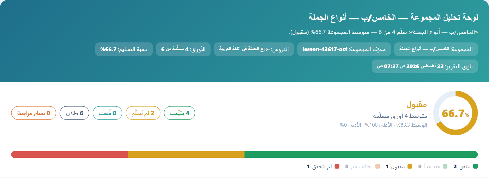
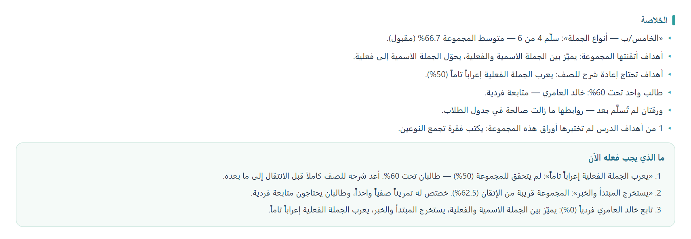
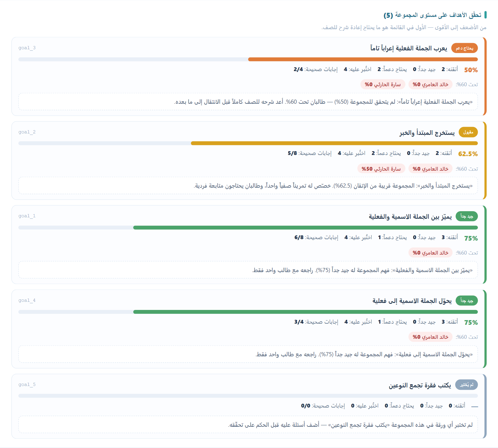
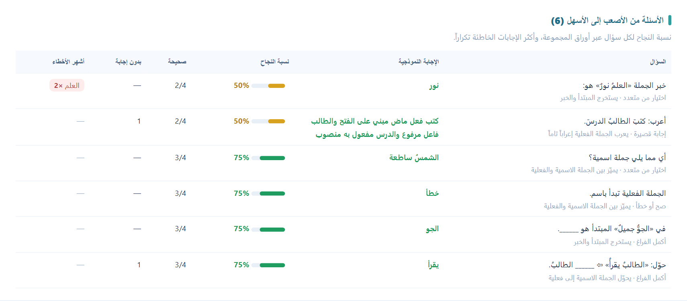
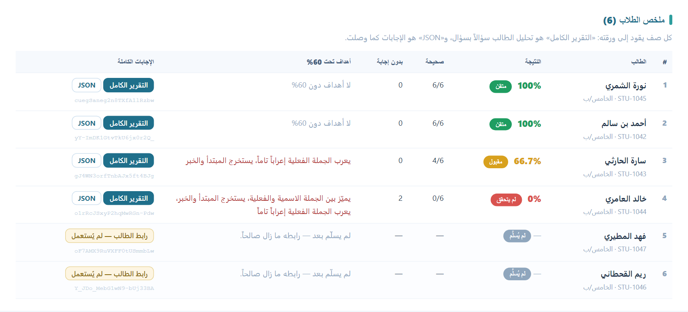
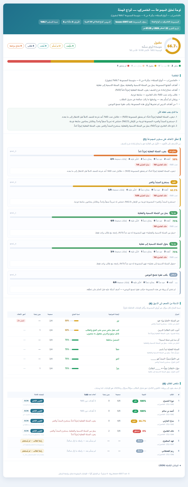
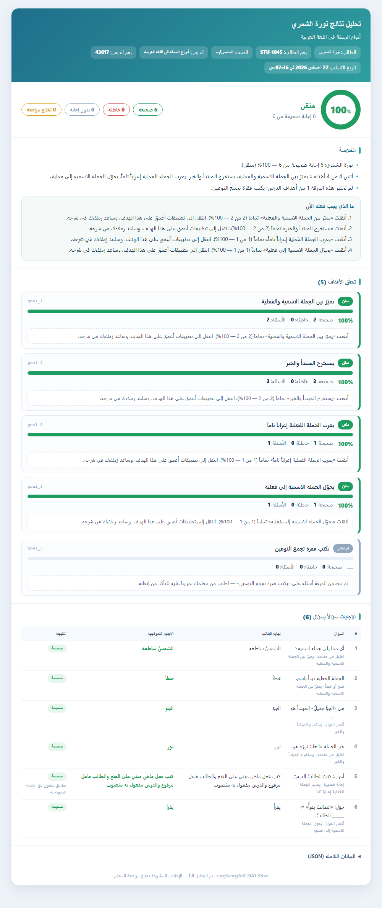
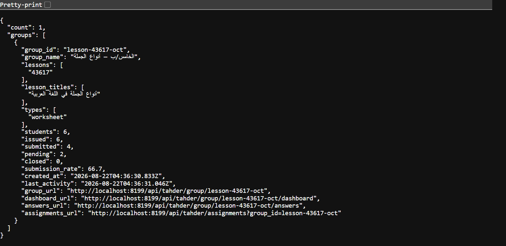

# The pipeline — database to graded sheet

[← README](../README.md) · [Lifecycle](LIFECYCLE.md) · [Templates](TEMPLATES.md) · [JSON](JSON.md) · [Render API](API.md) · [Pipeline](PIPELINE.md) · [Database](DATABASE.md) · [Deploy](DEPLOY.md) · [Extending](EXTENDING.md)

One call turns a lesson stored in MongoDB into a finished, cached web page.

**Two databases on one server.** Lessons are read from the generator's (`EDU_PIPELINE_DB`, default
`ai`) and nothing ever writes to it. Everything this platform produces — documents, links,
answers, analyses — is written to its own (`EDU_STORE_DB`, default `activities`). See
[DATABASE.md](DATABASE.md) for the collections and the Mongo user it needs.

```bash
curl -X POST http://localhost:8138/api/pipeline/document \
  -H "Content-Type: application/json" \
  -d '{ "type": "worksheet", "document_idx": "43617", "seed": 7 }'
```

Add `-H "X-Api-Key: …"` when the server has one configured, which it should.

```json
{
  "ok": true,
  "cached": false,
  "key": "worksheet-43617-7-2204f3296d",
  "type": "worksheet",
  "template": "worksheet",
  "document_idx": "43617",
  "lessonTitle": "النثر السعودي 2- فن المقالة",
  "seed": 7,
  "url": "http://localhost:8138/t/worksheet-43617-7-2204f3296d?t=NV-1l5k60sZ_…",
  "embedUrl": "…?t=…&embed=1",
  "printUrl": "…?t=…&print=1",
  "imageUrl": "…?t=…&image=1",
  "downloadUrl": "…?t=…&download=1",
  "dataUrl": "http://localhost:8138/api/pipeline/data/worksheet-43617-7-2204f3296d",
  "used": { "multiple_choice": 3, "true_false": 4, "complete": 4, "short_answer": 2 },
  "sources": { "questions": true, "worksheet": true, "summary": true }
}
```

`url` is the page. Ask again with the same three inputs and you get `"cached": true` and the same
URL — no database read, no re-render.

Add a `student_id` and the same call also hands back a single-use link that student can *answer*.
Submitting it grades the sheet, works out how far each of the lesson's goals was actually met, and
writes a report saying what to study next — see
[Answer sheets](#answer-sheets).

Add a `group_id` as well and every sheet issued under it becomes one class: one call issues the whole
roster, and `/api/pipeline/group/<id>/dashboard` is the teacher's page over all of them — participation,
the class average, the goals to reteach, the questions that failed, and every student with a link
back to their own answers. See [Groups](#groups).

This is an **extension**. It lives entirely in [`server/pipeline/`](../server/pipeline/) and is wired
into the core with two lines in `server/server.mjs`. Deleting the folder and those two lines removes
it completely; nothing else in the engine knows it exists.

**Try it in Postman.** Import [`postman/Pipeline.postman_collection.json`](postman/) and its
environment. The collection is runnable top to bottom — the first build captures the page key and
its signed URL, and every later request reuses them. Set `baseUrl` and `apiKey` in the environment
first. Regenerate it with `npm run make-pipeline-postman`.

---

## The three inputs

| Field | Aliases | Default | What it does |
|---|---|---|---|
| `type` | `document_type`, `doc_type`, `template`, `kind` | `worksheet` | which document to generate |
| `document_idx` | `documentIdx`, `idx`, `document`, `lesson` | **required** | the lesson to build from |
| `seed` | `random_seed`, `randomSeed` | `0` | which questions get drawn |

Everything works over `GET` (query string) or `POST` (JSON body). Query parameters win, so a saved
POST body can be re-aimed from the URL.

```bash
curl "http://localhost:8138/api/pipeline/document?type=cards&document_idx=43617&seed=7"
```

### The seed

The seed decides **which** questions are drawn, not how many. A lesson usually holds forty
questions; a card deck shows eight of them.

* the same seed always draws the same questions — that is what makes the cache correct, not merely fast
* a different seed draws a different set, so every student can get a different sheet from one lesson
* each question kind draws from its own stream, so raising `count.multiple_choice` does **not**
  reshuffle which true/false questions were picked
* `type=answers` draws from the same streams as `type=cards`, so `answers&seed=7` is the answer key
  for the deck that `cards&seed=7` produced

A seed can be a number or a word (`seed=class-3b`); both hash to the same generator.

---

## Document types

`GET /api/pipeline/types` returns this table live, with each type's tunable counts.

| `type` | Core template | Built from | What it is |
|---|---|---|---|
| `worksheet` | `worksheet` | questions + worksheets + summaries | ورقة عمل الطالب — blanks, true/false, MCQ cards, glossary, an application task, self-assessment |
| `cards` | `interactive-card` | questions | بطاقات أسئلة — cut-out review cards, one question each |
| `answers` | `interactive-card-answers` | questions | مفتاح الإجابة matching `cards` at the same seed |
| `lesson-plan` | `differentiated-lesson` | worksheets + summaries | خطة درس متمايزة — three ability groups, activities, assessment |
| `golden-minutes` | `golden-minutes` | worksheets + summaries + questions | بطاقة الدقائق الذهبية — first five and last five minutes |
| `summary` | `worksheet` | summaries + worksheets | ملخص الدرس — the summary split into revision cards |
| `learning-pattern` | `learning-pattern` | a fixed instrument (nothing drawn from the lesson) | استبيان أنماط التعلم — a VARK survey; the lesson supplies the accent, `student` fills the identity row, `count.questions` draws N statements per style. Answerable like any other sheet, but scored as a profile rather than marked |

Aliases are accepted: `questions` → `cards`, `answer-key` → `answers`, `lesson` / `plan` →
`lesson-plan`, `golden` → `golden-minutes`, `learning-styles` / `vark` → `learning-pattern`,
and so on.

### The lesson source

| Collection | Key | Used for |
|---|---|---|
| `questions` | `questions.{multiple_choice, true_false, complete, short_answer}` | every question, with its answer, difficulty and target goal |
| `worksheets` | `worksheet.{goals, applications, vocabulary, teacher_guidelines, structured_goals}` | objectives, application tasks, the glossary, teacher guidance, the differentiated columns |
| `summaries` | `summary.{opening, summary, ending}` | the warm-up, the lesson-plan intro, and the whole `summary` type |

A lesson missing one of the three still builds. The response's `sources` says what was found, and
`warnings` says what that cost.

---

## Tuning what gets drawn

`counts` overrides how many of each thing a type draws. **`0` means none**; asking for more than the
lesson holds gives you all of it. A default shown as `null` means "everything" — that is why
`goals` is `null` rather than `0` on the types that always list every objective.

```json
{
  "type": "worksheet",
  "document_idx": "43617",
  "seed": 7,
  "counts": { "multiple_choice": 5, "true_false": 6, "short_answer": 0 }
}
```

Over a query string, use `count.<name>` (or `counts=<json>`):

```bash
# five multiple-choice cards and nothing else
curl "…/document?type=cards&document_idx=43617&count.multiple_choice=5&count.true_false=0&count.complete=0&count.short_answer=0"
```

Each type accepts only its own count names — `GET /api/pipeline/types` lists them. An unknown name is
ignored and reported in `warnings` rather than silently doing nothing.

### Render options

These change the page itself, so each one produces its own cached page.

| Parameter | Default | Effect |
|---|---|---|
| `color` | *(per-lesson)* | the main color — a palette name or a hex value (see below) |
| `theme` | `pro` | `pro` (professional) or `playful` |
| `embed` | `false` | drop the page chrome for an `<iframe>`; also hides the toolbar |
| `toolbar` | `true` | the floating print / image / theme toolbar |
| `interactive` | `true` | `false` ships static markup with no JavaScript |
| `standalone` | `false` | inline every stylesheet so the file survives on its own |
| `print` / `image` | `false` | open the print dialog / save the A4 image once painted |
| `title` | *(from the sheet)* | override `<title>` |
| `exam_date` | *(blank)* | the day the sheet is sat — fills the date field every template carries (see below) |
| `subject` | *(blank)* | the subject — fills the **المادة** row (see below) |
| `school` | *(blank)* | the school's name — fills the **المدرسة** row (see below) |
| `teacher` | *(blank)* | the teacher's name — fills the **المعلم / المعلمة** row (see below) |
| `refresh` | `false` | rebuild even if a cached page exists |
| `format` | `json` | `html` returns the page directly, `redirect` sends a `302` to it |

### The main color

By default each lesson gets a stable accent derived from its `document_idx`, so the same lesson
always looks the same. Override it with `color`:

```bash
curl "…/document?type=cards&document_idx=43617&seed=7&color=teal"
curl "…/document?type=cards&document_idx=43617&seed=7&color=%23177a6c"   # url-encoded #
```

Accepts a palette name — `blue`, `sky`, `green`, `orange`, `yellow`, `purple`, `pink`, `red`,
`teal` — or a hex value (`#177a6c` or `#abc`). Anything else is ignored, reported in `warnings`, and
the lesson's own accent stands. The color is part of the cache key, so each color has its own page,
and it comes back as `color` in the JSON response.

### The exam date

Every template carries a date field, and it used to print empty for someone to fill in by hand.
`exam_date` fills it, so a whole class receives sheets that agree on when the sitting is:

```bash
curl "…/document?type=worksheet&document_idx=43617&exam_date=2026-09-15"
```

```json
{ "type": "worksheet", "document_idx": "43617", "exam_date": "2026-09-15" }
```

Also accepted: `date`, `exam_day`, `test_date`, `sitting_date`, and a nested
`{ "exam": { "date": "2026-09-15" } }`.

A **year-first** date (`2026-09-15`, `2026/9/5`, or a full ISO timestamp) is parsed and printed in
Arabic — *15 سبتمبر 2026*. Anything else is printed **exactly as sent**, so `الأسبوع الرابع` and
`الفصل الدراسي الأول` are usable answers too. Day-first forms like `15/09/2026` are *not* parsed —
they mean different days in different places, and a sheet that quietly prints the wrong one is worse
than a sheet that prints the string it was handed; such a value comes back verbatim.

Where it lands, per type:

| Type | Field |
|---|---|
| `worksheet`, `summary` | the student strip's date box — filled and **locked**, relabelled **تاريخ الاختبار** |
| `cards`, `answers` | a **تاريخ الاختبار** row in the identity block / meta bar |
| `lesson-plan` | a **تاريخ الاختبار** row beside الزمن (which is how *long* the lesson runs, not *when*) |
| `golden-minutes` | **اليوم والتاريخ** on the session block — with the weekday: *الثلاثاء، 15 سبتمبر 2026* — and the teacher's signature date |
| `learning-pattern` | the survey's own date field |

A filled date renders as locked text rather than an editable line: a sitting that has a date should
not come back stamped with another one. Send no `exam_date` and every field stays blank and
writable, exactly as before.

The date **is part of the cache key** — it changes the printed bytes, so the same worksheet sat on
two days is two pages. `2026-9-15` and `2026-09-15` hash to the same key. The response echoes it
back as `exam_date` (the ISO day) and `exam_date_text` (what the sheet shows), and an issued
assignment stores it, so a report always quotes the date the student actually saw.

### The school and the teacher

The header of every sheet has always carried a **المدرسة** row and a **المعلم / المعلمة** row, and
they were always printed empty for somebody to write in. `school` and `teacher` fill them, the same
way `exam_date` fills the date:

```bash
curl "…/document?type=worksheet&document_idx=43617&school=ثانوية الأمير محمد&teacher=أ. سارة الحارثي"
```

```json
{
  "type": "worksheet", "document_idx": "43617",
  "school": { "id": "SCH-19", "name": "ثانوية الأمير محمد" },
  "teacher": { "id": "T-7", "name": "أ. سارة الحارثي" }
}
```

Three spellings, like the student: `?school=…`, `?school_id=…&school_name=…`, or a nested
`{ "school": { "id": …, "name": … } }` — and the same for the teacher.

**A bare `?school=` / `?teacher=` is the NAME**, where a bare `?student=` is an id. There is no
school list and no teacher list in this database — schools, teachers and classes belong to the
partner platform and arrive as parameters — so an id here resolves to nothing, and the name is the
half that gets printed. Send the id as well (`school_id`, `teacher_id`) and it is stored and echoed
back untouched; nothing is looked up either way.

Where they land, per type:

| Type | Rows |
|---|---|
| `worksheet`, `summary` | the two header rows, filled and **locked** instead of editable |
| `cards` | the identity block — school always, teacher when named |
| `answers` | the **المدرسة** chip on the meta bar |
| `lesson-plan` | added to the info block, but **only** when named — a plan prints values, not blank lines |
| `golden-minutes` | **اسم المدرسة** on the session block, and **اسم المعلم** on the signature block |
| `learning-pattern` | added above the survey's date field, only when named |

Name neither and every one of those rows stays exactly as it was: blank, editable, waiting for a pen.

Both are **part of the cache key**: two schools asking for the same lesson must not be served one
another's page. Both are echoed back as `school` and `teacher` on the response, stored on the
assignment when a link is issued, kept on the document record, copied onto the analysis, and printed
on the student's report and the group dashboard — so a result read months later still says which
school it came from and who set it.

### Editable fields on the page

The header identity fields — **school**, **teacher**, **المادة** (the subject) and the lesson
**title** — render as editable on the built page *when the request did not name them*: a teacher
clicks and types their school, name and subject directly on screen before printing. Pass `school` /
`teacher` / `subject` and those three arrive printed and fixed instead. The worksheet's student strip (name, class, date) stays editable as always. No
parameter needed. Edits are per-session — reopening the page starts blank — since the page is shared
and cached.

### The subject line — **المادة**

`subject` is **the value the المادة row prints**, on every document type, and it comes from the
request:

```bash
curl "…/document?type=worksheet&document_idx=43617&subject=المهارات الرقمية"
```

```json
{
  "type": "worksheet", "document_idx": "43617",
  "subject": { "id": "SUB-204", "name": "المهارات الرقمية" }
}
```

Same three spellings as the school and the teacher — `?subject=…`,
`?subject_id=…&subject_name=…`, or a nested `{ "subject": { "id": …, "name": … } }` — and the same
rule: **a bare `?subject=` is the NAME**. `material` and `course` are accepted as aliases for the
name. The id is stored and echoed back untouched; nothing is looked up.

> **This replaced a database lookup.** المادة used to be *derived* from the lesson documents —
> `_metadata.content_analysis.subject_area` and any other `subject` / `subject_name` / `material` /
> `course` field they carried, wherever it sat, mapped through an Arabic label table (`science`,
> `علوم` and `Science / Grade 2` all printed **العلوم**). That was a guess this server is in the
> worst position to make, and it was wrong often enough to matter. The platform asking for the
> sheet knows the subject for certain, so it sends it beside the lesson id and we print that.
>
> **Send no `subject` and the المادة row is blank and editable** — a line for a teacher to write
> on, exactly like المدرسة. It does **not** fall back to the database. A caller that has not
> started sending `subject` will see that row empty; that is the intended behaviour, not a
> regression.

Where it lands, per type:

| Type | Row |
|---|---|
| `worksheet`, `summary` | the **المادة** header row — filled and locked when named, blank and editable when not |
| `cards`, `answers` | the sheet subtitle (`answers` also uses it as the subject-block title) |
| `lesson-plan` | added to the info block, but **only** when named — a plan prints values, not blank lines |
| `golden-minutes` | **المادة والصف** on the session block |

It is **part of the cache key**: two subjects asking for the same lesson must not be served one
another's page, and a request that names none prints a blank line, which is a third page. It comes
back as `subject` on the response, is stored on the document record and on any assignment issued,
and rides in the canonical request — so the student's answerable copy at `/a/<id>` prints the same
المادة the teacher's copy did.

`GET /api/pipeline/lesson/:document_idx` still returns the lesson's own *derived* `subject` /
`subjectName`. Nothing prints them any more; they survive as the lesson's own description, and the
document record falls back to the derived value when a caller named none, so a record is never
blank.

Pages already built keep the value they were built with: `?refresh=1` rebuilds one, `DELETE
/api/pipeline/cache` clears the lot. `CACHE_VERSION` was bumped to `6` for this change, so every
page cached before it rebuilds on first request rather than serving the old, guessed value.

### Branding

Every generated sheet carries the site logo (`assets/img/logo.png`). Point it
elsewhere per environment with `EDU_PIPELINE_LOGO` (a URL or root-relative path) and
`EDU_PIPELINE_LOGO_WIDTH`.

---

## Endpoints

| Method | Path | Returns |
|---|---|---|
| `GET` `POST` | `/api/pipeline/document` | build or serve → the JSON above |
| `GET` | `/t/:key` | **the page** |
| `GET` | `/api/pipeline/document/:key` | what was built under that key |
| `DELETE` | `/api/pipeline/document/:key` | drop it, so the next call rebuilds |
| `GET` | `/api/pipeline/data/:key` | the worksheet JSON the page was rendered from |
| `GET` | `/api/pipeline/lesson/:document_idx` | the normalized lesson, for inspection |
| `GET` | `/api/pipeline/types` | the document types and their counts |
| `GET` | `/api/pipeline/cache` | what is cached · `DELETE` empties it |
| `GET` | `/api/pipeline/health` | extension, database and cache status |

Issuing a sheet to a student, and everything that follows from it — see
[Answer sheets](#answer-sheets):

| Method | Path | Returns |
|---|---|---|
| `POST` | `/api/pipeline/assign` | issue a single-use answer link — or a whole class |
| `GET` `POST` | `/api/pipeline/batch` | **a roster in, one exam link per student out** |
| `GET` | `/a/:id?t=<token>` | **the answerable sheet** — the student's link |
| `POST` | `/api/pipeline/submit` | `{assignment_id, token, answers}` → the analysis |
| `GET` | `/api/pipeline/result/:id` | the analysis JSON |
| `GET` | `/api/pipeline/report/:id` | the analysis as a page |
| `GET` | `/api/pipeline/assignments` | what has been issued, newest first |
| `GET` | `/api/pipeline/assignment/:id` | one issued sheet · `DELETE` revokes it |

A whole class at a time — every sheet issued under the same `group_id`; see
[Groups](#groups):

| Method | Path | Returns |
|---|---|---|
| `GET` | `/api/pipeline/groups` | the groups that exist, with their counts |
| `GET` | `/api/pipeline/group/:group_id` | **the full group analysis**, as JSON |
| `GET` | `/api/pipeline/group/:group_id/dashboard` | the same analysis, as a page |
| `GET` | `/api/pipeline/group/:group_id/answers` | every answer every student in it sent |
| `DELETE` | `/api/pipeline/group/:group_id` | revoke the links still outstanding |

`group` and `groups`, `assignment` and `assignments` are both accepted in the path.
`/group/:id?format=html` returns the dashboard, and `/group/:id/report` is an alias for
`/group/:id/dashboard`.

Errors use the same envelope as the core API:

```json
{ "error": { "code": "lesson-not-found", "message": "No lesson found for document_idx \"99999\"." } }
```

`400` missing/unknown input · `401` bad key · `404` unknown lesson or page · `405` wrong method ·
`410` the link is spent, revoked or expired · `413` body too large · `500` unexpected.

---

## Answer sheets

*One student, one link, one submission.*

Everything above builds a sheet for a *class*. Passing a student turns it into a sheet for a
*person*: their name and id are printed on it, the link opens once, and what they answer is read
back — against the goals the lesson set out to teach, or, for a survey, against the styles the
instrument measures ([surveys](#surveys-a-profile-instead-of-a-mark)).

```bash
curl -X POST http://localhost:8138/api/pipeline/document \
  -H "Content-Type: application/json" -H "X-Api-Key: …" \
  -d '{
        "type": "worksheet",
        "document_idx": "43617",
        "seed": 7,
        "student": { "id": "STU-1042", "name": "أحمد بن سالم", "classroom": "الخامس/ب" }
      }'
```

The usual document response comes back, plus:

```json
{
  "key": "worksheet-43617-7-8688f5edfe",
  "url": "http://localhost:8138/t/worksheet-43617-7-8688f5edfe",
  "assignment": {
    "assignment_id": "Zmc7vSK1TSA7aJ6ihNYMeA",
    "status": "issued",
    "student": { "id": "STU-1042", "name": "أحمد بن سالم", "classroom": "الخامس/ب" },
    "question_count": 13,
    "goal_count": 5,
    "answer_url": "http://localhost:8138/a/Zmc7vSK1TSA7aJ6ihNYMeA?t=4Y0eSH6TaA0H…",
    "report_url": "http://localhost:8138/api/pipeline/report/Zmc7vSK1TSA7aJ6ihNYMeA?t=…",
    "result_url": "http://localhost:8138/api/pipeline/result/Zmc7vSK1TSA7aJ6ihNYMeA?t=…",
    "status_url": "http://localhost:8138/api/pipeline/assignment/Zmc7vSK1TSA7aJ6ihNYMeA"
  }
}
```

`url` is the teacher's copy — cached, printable, shareable, exactly as before. `answer_url` is the
student's, and it behaves nothing like it.

### Identifying the student

Three spellings, because three kinds of caller send it three ways:

| Form | Example |
|---|---|
| query string | `?student_id=STU-1042&student_name=أحمد&student_class=الخامس/ب` |
| flat body | `{ "student_id": "STU-1042", "student_name": "أحمد" }` |
| nested body | `{ "student": { "id": "STU-1042", "name": "أحمد" } }` |

`student_id` alone is enough. Aliases: `student_class` / `classroom` / `grade` for the class,
`student_section` / `section` for the section.

**This works on every document type.** A worksheet, a card deck, an answer key, a lesson plan, a
golden-minutes card and a summary all print the student they were issued to. Only the two types that
ask questions — `worksheet` and `cards` — can also be *answered*, so only those get a link; the
others come back with a warning saying why.

The student is part of the cache key, so two students never share one rendered page. Passing
`assign=0` prints the sheet without issuing a link.

The school, the teacher and the sitting date travel the same way and are snapshots for the same
reason — see [The school and the teacher](#the-school-and-the-teacher) and
[The exam date](#the-exam-date).

### The link opens once

```
issued  ──open──▶  issued  ──submit──▶  submitted   (link dead)
   └────────────revoke / expire───────▶  revoked     (link dead)
```

Opening the link is recorded (`opened_at`, `attempts`) but does not spend it — a student may close
the tab and come back. **Submitting** spends it. Every later request to that URL is `410`, with an
Arabic page that explains it rather than a JSON error, because the person reading it clicked a link.

Nothing reopens a spent link. Another attempt means another `POST /assign`, which mints a new id and
a new token — so an old link that leaks is worth nothing, and every attempt is its own record with
its own result instead of one record quietly overwritten.

`DELETE /api/pipeline/assignment/:id` revokes an unsubmitted link (sent to the wrong student, test
cancelled). An already-submitted one stays submitted and keeps its result.

### What the student's page is

The same sheet, rendered with an answer layer. Every question carries `data-qid`; options are
tickable, blanks are typeable, lines are writable; a bar along the bottom shows how many questions
are answered and submits them.

**The correct answers are not on the page and never reach the browser.** The key lives on the server
beside the assignment. The page knows only question ids, kinds and option text — everything on it is
something the student can already read. That is also why the page is rendered fresh rather than
served from the cache: it carries a token belonging to one student.

### Submitting

```bash
curl -X POST http://localhost:8138/api/pipeline/submit \
  -H "Content-Type: application/json" \
  -d '{
        "assignment_id": "Zmc7vSK1TSA7aJ6ihNYMeA",
        "token": "4Y0eSH6TaA0H…",
        "answers": {
          "mc_1": "الجملة الاسمية",
          "tf_1": "خطأ",
          "cp_2": ["المبتدأ", "الخبر"],
          "sa_1": "الطالب مجتهد، المبتدأ الطالب والخبر مجتهد"
        }
      }'
```

`answers` is `{question_id: answer}` — that is the whole contract. The browser sends it for you; the
shape is documented so a mobile app or an LMS can submit without one.

Answers are accepted the way a student would write them:

| Kind | Accepted |
|---|---|
| `multiple_choice` | the option text, its Arabic letter (`أ`), `أ. الخيار`, or its index |
| `true_false` | `صح` / `خطأ`, `true` / `false`, `نعم` / `لا`, `1` / `0`, `✓` / `✗` |
| `complete` | one string per blank, as an array or comma-separated |
| `short_answer` | free text |

Comparison ignores tashkeel, tatweel, `أ إ آ ← ا`, `ة ← ه`, `ى ← ي`, punctuation and Arabic-Indic
digits, so a spelling difference a teacher would not notice does not become a wrong answer.

`/submit`, `/result` and `/report` are the only endpoints that do **not** require `X-Api-Key`: the
browser holding the link has a token and nothing else, and each of them verifies that token itself.

### The analysis

A mark out of ten is not something a teacher can act on. A lesson has goals, every question was
written to test one of them, so the unit of analysis is the goal:

```json
{
  "overall": { "total": 13, "correct": 10, "wrong": 3, "unanswered": 1,
               "percentage": 76.9, "mastery": "proficient", "mastery_label": "جيد جداً" },

  "goals": {
    "goal_1": { "goal_id": "goal_1", "goal_text": "يميّز بين الجملة الاسمية والفعلية",
                "percentage": 100, "correct": 4, "wrong": 0, "total": 4,
                "unanswered": 0, "needs_review": 0,
                "mastery": "mastered", "mastery_label": "متقن", "color": "#1f9d61",
                "question_ids": ["cp_1", "cp_4", "tf_1", "mc_1"],
                "recommendation": "أتقنت «يميّز بين الجملة الاسمية والفعلية» تماماً (4 من 4 — 100%). …" },

    "goal_3": { "percentage": 33.3, "correct": 1, "wrong": 2, "total": 3,
                "mastery": "not-met", "mastery_label": "لم يتحقق",
                "recommendation": "لم تتحقق من «يعرب الفعل والفاعل» بعد (1 من 3 — 33.3%). ابدأ هذا الهدف من الأساس: …" }
  },

  "report": {
    "headline": "أحمد بن سالم: 10 إجابة صحيحة من 13 — 76.9% (جيد جداً).",
    "summary": "…",
    "strengths": [ … ], "needs_work": [ … ], "untested": [ … ],
    "next_steps": ["…weakest goal first…"]
  },

  "questions": [ /* one row each: student answer, correct answer, score, why */ ],
  "answers":   { /* exactly what was submitted, untouched */ }
}
```

Five bands, by percentage: `mastered` ≥ 90 · `proficient` ≥ 75 · `developing` ≥ 60 · `weak` ≥ 40 ·
`not-met` below. Each carries the wording used in the report, and each recommendation names the goal
it is about — `«…»` in the sentence is the goal's own text from the lesson.

Three judgement calls worth knowing:

* **An unanswered question counts as wrong** in the percentage — a blank demonstrates nothing — but
  `unanswered` is reported separately, so "got it wrong" and "ran out of time" stay distinguishable.
* **Goals with no questions are still listed**, at `percentage: null`. If lesson 5 has five goals and
  the sheet reached four of them, the report says which one went untested rather than showing a
  four-goal lesson.
* **Short answers are scored by overlap with the model answer** and say so: `confidence:
  "heuristic"`, and a middling score comes back `needs_review: true` rather than being quietly
  counted. That is the honest limit of automatic grading.

Questions the lesson never linked to a goal land under `unassigned` rather than being dropped —
"three questions map to no goal" is information, not a rounding error.

### Surveys: a profile instead of a mark

`learning-pattern` is answerable like every other type — the same `student_id`, the same single-use
link, the same `POST /api/pipeline/submit` — but its statements have no right answer, so it is
**scored, not marked**. The built document says so with `scoring: "profile"`, and the analysis comes
back with the same top-level keys carrying survey meanings.

```bash
curl -X POST http://localhost:8138/api/pipeline/assign \
  -H "Content-Type: application/json" -H "X-Api-Key: …" \
  -d '{
        "type": "learning-pattern",
        "document_idx": "43617",
        "seed": 7,
        "group_id": "g5b",
        "students": [ { "id": "STU-1042", "name": "أحمد بن سالم", "classroom": "الخامس/ب" } ]
      }'
```

What changes, and only this:

| key | on a worksheet | on a survey |
|---|---|---|
| `scoring` | `"mastery"` | `"profile"` |
| `goals` | one entry per lesson goal | one entry per learning style, `goal_id: "style:visual"` |
| a goal's `percentage` | how much of it was answered correctly | the **affinity** for that style — its points over its ceiling |
| `overall.percentage` | the mark | the dominant style's affinity |
| `overall.mastery_label` | متقن · جيد جداً · … | the dominant style — بصري · متوازن · … |
| `questions[].kind` | `multiple_choice`, `true_false`, … | `scale` |
| `questions[].correct` | the answer was right | a usable response was recorded |
| `questions[].points` | — | what the ticked point was worth |
| `profile` | absent | the verdict, the scale, and every style in order |

```json
{
  "scoring": "profile",
  "overall": { "total": 16, "answered": 16, "unanswered": 0,
               "points": 44, "max_points": 64, "percentage": 100, "completion": 100,
               "mastery": "style:visual", "mastery_label": "بصري" },

  "profile": {
    "verdict": {
      "kind": "single", "key": "visual", "label": "بصري", "percentage": 100,
      "description": "تتعلّم بالعين: الصور والرسوم والمخططات تثبّت المعلومة عندك أكثر من الكلام.",
      "tips": [ "حوّل الدرس إلى خريطة ذهنية أو مخطط ملوّن." ]
    },
    "scale": [ { "label": "تمامًا", "value": 4 }, { "label": "أحيانًا", "value": 3 },
               { "label": "قليلًا", "value": 2 }, { "label": "لا يمثلني", "value": 1 } ],
    "styles": [
      { "key": "visual",      "label": "بصري",        "points": 16, "max_points": 16,
        "percentage": 100, "strength": "dominant", "strength_label": "نمط قوي جداً" },
      { "key": "auditory",    "label": "سماعي",       "points": 12, "max_points": 16, "percentage": 75 },
      { "key": "kinesthetic", "label": "حركي",        "points":  8, "max_points": 16, "percentage": 50 },
      { "key": "reading",     "label": "قراءة/كتابة", "points":  8, "max_points": 16, "percentage": 50 }
    ]
  },

  "goals": {
    "style:visual": { "goal_id": "style:visual", "goal_text": "بصري", "style": "visual",
                      "total": 4, "points": 16, "max_points": 16, "percentage": 100,
                      "mastery": "dominant", "mastery_label": "نمط قوي جداً",
                      "recommendation": "«بصري»: 16 من 16 نقطة (100%) — نمط قوي جداً. …" }
  }
}
```

**The scoring rule.**

| | |
|---|---|
| score of a style | Σ points of the statements that feed it |
| the verdict | the single highest style |
| a tie between two or more | `verdict.balanced` — "متوازن" |
| nothing ticked at all | `verdict.undecided` — "غير محدد" |

The comparison is on **points**, not percentages, which is why `counts.questions` draws N statements
*per style*: an unequal ceiling would make "highest score" and "strongest preference" two different
answers. A skipped statement still counts against its style's ceiling — a survey where skipping
raises your score is a broken survey.

**The report page and the dashboard need no special case.** They read `goals`, `overall` and
`questions` by name, and a survey fills all three. The report renames three columns and reverses one
sort (strongest style first, rather than weakest goal first) and is otherwise the same page.

**What the student sees.** The panel after submitting shows the dominant style, what it means, a bar
per style and the first few tips — not a percentage-correct, which for a survey would be meaningless
at best and discouraging at worst.

### Where the result goes

Three destinations, in this order, and none of them can fail the submission:

1. **`EDU_PIPELINE_OUTPUT_DIR`** — `<assignment>.json` (the analysis) and `<assignment>.html` (a
   standalone, printable report page: overall score, goals weakest-first with a recommendation each,
   then every question with what was answered and why it scored what it did).
2. **stdout** — a summary block and the full JSON, so a deployment with no backend yet can watch the
   logs. `EDU_PIPELINE_PRINT_RESULTS=0` turns it off.
3. **your backend**, when configured:

   ```bash
   EDU_PIPELINE_SUBMIT_ENDPOINT=https://lms.example.com/api/worksheet-submissions
   EDU_PIPELINE_ANALYSIS_ENDPOINT=https://lms.example.com/api/worksheet-analysis
   EDU_PIPELINE_BACKEND_TOKEN=…            # sent as Authorization: Bearer …
   EDU_PIPELINE_BACKEND_HEADER=Authorization
   EDU_PIPELINE_BACKEND_TIMEOUT_MS=8000
   ```

   The two carry different things and a backend may want either or both: `SUBMIT` gets
   `{assignment_id, student_id, answers, …}` — what the student said; `ANALYSIS` gets the whole
   object above — what it means. Both are POSTed as JSON, in parallel.

The file is written before the network is touched, so a backend that is down, slow or not configured
yet costs nothing: the result is on disk and can be replayed. A failed POST is reported in the submit
response (`delivery.deliveries[].ok`) and logged — never turned into a failed submission. The student
has already answered, and telling them their work did not save because an internal service was
unreachable would be a lie.

With neither endpoint set the response says so:

```json
{ "delivery": { "configured": false, "deliveries": [],
                "note": "No backend endpoint is configured — the result was saved and logged only. …" } }
```

### Where a result is stored

Four places, in this order, and none of them may lose the work:

| | |
|---|---|
| MongoDB | `submissions` (what arrived, untouched, plus one mark per question) and `analyses` (what it means, per goal) |
| `EDU_PIPELINE_OUTPUT_DIR` | `<id>.json` and `<id>.html` — a human-readable copy |
| stdout | the analysis, printed, for a deployment watching its logs |
| the backend | POSTed to the two endpoints when they are set, and recorded in `deliveries` either way |

The database is written first because it is the one that gets queried later. The network is touched
last, so a backend that is down costs the school nothing.

### The things that hold answer keys

**The `assignments` collection holds the answer key and the token of every issued link.** Do not
hand its Mongo user to anything that only needs to read results.

On disk, `EDU_PIPELINE_OUTPUT_DIR` holds graded student work and `EDU_PIPELINE_ASSIGN_DIR` may
still hold records from before the database. Point both outside the served site root:

```bash
EDU_PIPELINE_ASSIGN_DIR=/var/lib/edu/assignments
EDU_PIPELINE_OUTPUT_DIR=/var/lib/edu/output
```

Requests for those paths are refused either way (see *The server serves its own directory*), and
`/api/pipeline/health` warns while they are inside it — but they are better off not being there at all.

Upgrading from the file-based store? `npm run store:import` reads both directories into MongoDB. It
is safe to run twice, and it leaves the files where they are.

---

## Groups

*One id, one class, one dashboard.*

Everything above is about one student. A teacher's question is about thirty of them: *what did the
class not understand, and who do I sit with tomorrow.*

Add a **`group_id`** when you issue a sheet and it is filed under that group. The id is whatever you
use to mean "these sheets go together" — a lesson id, a class code, an exam session, a term. Nothing
registers it in advance and nothing validates it against a list; the group is discovered by reading
the sheets that carry it.

```bash
curl -X POST http://localhost:8138/api/pipeline/assign \
  -H "Content-Type: application/json" -H "X-Api-Key: …" \
  -d '{
        "type": "worksheet",
        "document_idx": "43617",
        "seed": 7,
        "group_id": "lesson-43617-oct",
        "group_name": "الخامس/ب — أنواع الجملة",
        "student": { "id": "STU-1042", "name": "أحمد بن سالم", "classroom": "الخامس/ب" }
      }'
```

Every call below, runnable and with the response it returns, is in
[`examples/group-dashboard.http`](../examples/group-dashboard.http) — and as folder *7 · المجموعة
ولوحة التحليل* in the Postman collection.

Spelled three ways, like the student:

| Form | Example |
|---|---|
| query string | `?group_id=lesson-43617-oct&group_name=الخامس/ب` |
| flat body | `{ "group_id": "lesson-43617-oct", "group_name": "الخامس/ب" }` |
| nested body | `{ "group": { "id": "lesson-43617-oct", "name": "الخامس/ب" } }` |

Aliases for the id: `group`, `lesson_group`, `class_id`, `cohort`. `group_name` is a label for the
dashboard heading — the **id** is what everything joins on. Ids take up to 64 characters: letters
(Arabic included), digits, spaces, and `. _ - : @`.

**A group is not part of the cache key.** It changes nothing on the printed page, so two classes
answering the same lesson still share one cached render — the grouping lives on the assignment
record, not on the HTML.

### Issuing a whole class in one call

`students: [ … ]` issues one link per student, all under the same group:

```bash
curl -X POST http://localhost:8138/api/pipeline/assign \
  -H "Content-Type: application/json" -H "X-Api-Key: …" \
  -d '{
        "type": "worksheet",
        "document_idx": "43617",
        "seed": 7,
        "group_id": "lesson-43617-oct",
        "group_name": "الخامس/ب — أنواع الجملة",
        "students": [
          { "id": "STU-1042", "name": "أحمد بن سالم", "classroom": "الخامس/ب" },
          { "id": "STU-1043", "name": "سارة الحارثي", "classroom": "الخامس/ب" },
          { "id": "STU-1044", "name": "خالد العامري", "classroom": "الخامس/ب" }
        ]
      }'
```

```json
{
  "ok": true,
  "group": { "id": "lesson-43617-oct", "name": "الخامس/ب — أنواع الجملة" },
  "issued": 3,
  "assignments": [
    {
      "assignment_id": "Zmc7vSK1TSA7aJ6ihNYMeA",
      "status": "issued",
      "student": { "id": "STU-1042", "name": "أحمد بن سالم", "classroom": "الخامس/ب", "section": "" },
      "group": { "id": "lesson-43617-oct", "name": "الخامس/ب — أنواع الجملة" },
      "group_id": "lesson-43617-oct",
      "question_count": 6,
      "goal_count": 5,
      "answer_url": "http://localhost:8138/a/Zmc7vSK1TSA7aJ6ihNYMeA?t=4Y0eSH6TaA0H…",
      "report_url": "http://localhost:8138/api/pipeline/report/Zmc7vSK1TSA7aJ6ihNYMeA?t=…",
      "page_url": "http://localhost:8138/t/worksheet-43617-7-8688f5edfe",
      "group_dashboard_url": "http://localhost:8138/api/pipeline/group/lesson-43617-oct/dashboard"
    }
  ],
  "group_url": "http://localhost:8138/api/pipeline/group/lesson-43617-oct",
  "dashboard_url": "http://localhost:8138/api/pipeline/group/lesson-43617-oct/dashboard",
  "answers_url": "http://localhost:8138/api/pipeline/group/lesson-43617-oct/answers",
  "assignments_url": "http://localhost:8138/api/pipeline/assignments?group_id=lesson-43617-oct"
}
```

A roster row that names nobody is **reported, not fatal** — a class pasted from a spreadsheet has
blank rows in it, and failing thirty-nine links because of the fortieth would be the wrong trade:

```json
{ "issued": 39, "skipped": [ { "index": 12, "reason": "no student id or name", "entry": {} } ] }
```

Up to 200 students per call. A bigger class is several calls with the same `group_id` — they land in
the same group. Sheets are built one after another, not all at once: each student's copy is its own
render, and forty concurrent builds would be a burst for no gain.

Issuing one at a time works exactly as well. `POST /assign` (or `/document` with a `student_id`)
called thirty times with the same `group_id` produces the same group.

### `POST /api/pipeline/batch` — a roster in, exam links out

`/assign` issues **one** link and grew a `students` array as a convenience. `/batch` is the other
way round: the roster is the point, so it is required, no top-level student is needed, and the
response **leads with a flat `links` array** — one row per student, the exam link and nothing to dig
through. That is the shape a caller mail-merges, pastes into a message, or writes straight into
their own system.

```bash
curl -X POST http://localhost:8138/api/pipeline/batch \
  -H "Content-Type: application/json" -H "X-Api-Key: …" \
  -d '{
        "type": "worksheet",
        "document_idx": "43617",
        "seed": 7,
        "exam_date": "2026-09-15",
        "group_id": "g5b-midterm",
        "group_name": "الخامس/ب — اختبار منتصف الفصل",
        "unique_seed": true,
        "students": [
          "STU-1042",
          { "id": "STU-1043", "name": "سارة الحارثي", "classroom": "الخامس/ب" },
          { "id": "STU-1044", "name": "أحمد العامري", "exam_date": "2026-09-22", "seed": 12 }
        ]
      }'
```

```json
{
  "ok": true,
  "requested": 3,
  "issued": 3,
  "failed": 0,
  "type": "worksheet",
  "document_idx": "43617",
  "exam_date": "2026-09-15",
  "exam_date_text": "15 سبتمبر 2026",
  "unique_seed": true,
  "group": { "id": "g5b-midterm", "name": "الخامس/ب — اختبار منتصف الفصل" },
  "links": [
    {
      "student_id": "STU-1043",
      "student_name": "سارة الحارثي",
      "classroom": "الخامس/ب",
      "section": "",
      "assignment_id": "qd2W93BcV--RyrAGtjmeOg",
      "exam_url": "http://localhost:8138/a/qd2W93BcV--RyrAGtjmeOg?t=cS54o32cVJvzGKYFZTgx…",
      "report_url": "http://localhost:8138/api/pipeline/report/qd2W93BcV--RyrAGtjmeOg?t=…",
      "exam_date": "2026-09-15",
      "seed": 2750657876,
      "expires_at": null
    }
  ],
  "assignments": [ "… the full record for each, exactly as /assign returns it …" ],
  "dashboard_url": "http://localhost:8138/api/pipeline/group/g5b-midterm/dashboard",
  "group_url": "http://localhost:8138/api/pipeline/group/g5b-midterm",
  "answers_url": "http://localhost:8138/api/pipeline/group/g5b-midterm/answers",
  "assignments_url": "http://localhost:8138/api/pipeline/assignments?group_id=g5b-midterm"
}
```

**The roster.** An entry is a bare id (`"STU-1042"`) or an object. The object names the student —
`id`, `name`, `classroom`, `section` — and may re-aim the request **for that one student**:

| Per-student key | Effect |
|---|---|
| `seed` | that student's own draw — wins over `unique_seed` |
| `exam_date` | a different sitting, for a make-up |
| `document_idx` | a different lesson |
| `type` | a different document type |

**`unique_seed`.** Gives every student their own draw of the same lesson — no two sheets in the room
carry the same questions. The seed is derived from the call's `seed` plus the student's identity,
not from a random number, so the batch is **repeatable**: re-running it hands each student back the
sheet they already hold rather than a new one. Aliases: `vary`, `vary_seed`, `shuffle_per_student`.

**Partial batches succeed.** A row that names nobody, or a student whose build fails, is reported in
`skipped` while every other link is still returned — thirty-nine working links plus a named failure
is worth more to a teacher than a `400` with nothing in it. `ok` is `false` only when *nothing* could
be issued (`422`).

```json
{ "issued": 39, "failed": 1, "skipped": [ { "index": 12, "reason": "no student id or name", "entry": {} } ] }
```

**Ids alone** can go over a query string, for a call made from a shell or a browser bar. Anything
richer than an id needs the JSON body:

```bash
curl "…/batch?document_idx=43617&type=worksheet&exam_date=2026-09-15&group_id=g5b&students=STU-1042,STU-1043"
```

Up to 200 students per call (`EDU_PIPELINE_ROSTER_LIMIT`); a bigger class is several calls with the
same `group_id` and they land in the same group. Sheets are built one after another, not all at
once. `/api/pipeline/assign/batch` and `/api/pipeline/batch/assign` are accepted aliases for the
path, and `/assign` with a `students` array keeps working exactly as it did.

### The dashboard

```
GET /api/pipeline/group/lesson-43617-oct/dashboard      the page
GET /api/pipeline/group/lesson-43617-oct                the same analysis, as JSON
```

The page is standalone HTML — printable, no assets to load — and it is laid out in the order a
teacher asks the questions:

1. **participation**, before any average — 4 of 6 handed in
2. **the class average**, with the median and the spread behind it, and the mastery bands as one bar
3. **the goals, weakest first** — the reteaching list, each with who fell below 60% and what to do
4. **the questions, hardest first** — success rate per item, and the wrong answers more than one
   student gave (a repeated wrong answer is a misconception with a name)
5. **every student**, each row linking to *their own* full report and answers

It is computed per request, never cached: the numbers change every time a student submits, and a
dashboard that is stale by one submission is one a teacher stops trusting.

The JSON carries exactly what the page draws:

```jsonc
{
  "schema": "pipeline.group-analysis/1",
  "group": { "id": "lesson-43617-oct", "name": "الخامس/ب — أنواع الجملة" },
  "generated_at": "2026-08-22T04:08:05.785Z",
  "lessons": [ { "document_idx": "43617", "lesson_title": "أنواع الجملة", "type": "worksheet", "sheets": 6 } ],

  "participation": {
    "issued": 6, "students": 6, "opened": 4, "submitted": 4,
    "pending": 2, "revoked": 0, "missing_results": 0, "submission_rate": 66.7
  },

  "overall": {
    "answered_students": 4,
    "average_percentage": 66.7, "median_percentage": 83.3,
    "highest_percentage": 100, "lowest_percentage": 0,
    "total_questions": 24, "total_correct": 16, "unanswered": 2, "needs_review": 0,
    "mastery": "developing", "mastery_label": "مقبول", "color": "#d8a11e"
  },

  "distribution": [ { "level": "mastered", "label": "متقن", "count": 2, "percentage": 50, "color": "#1f9d61" } ],

  "goals": [                                    // weakest first — the reteaching list
    {
      "goal_id": "goal_3",
      "goal_text": "يعرب الجملة الفعلية إعراباً تاماً",
      "students": 4, "tested_students": 4,
      "correct": 2, "total": 4, "unanswered": 1, "needs_review": 0,
      "mastered": 2, "proficient": 0, "struggling": 2,
      "average_percentage": 50,                 // the mean of what the students scored
      "class_percentage": 50,                   // every answer to this goal, pooled
      "median_percentage": 50,
      "mastery": "weak", "mastery_label": "يحتاج دعم", "color": "#e07b39",
      "students_needing_work": [
        { "assignment_id": "7buCBO3…", "student_id": "STU-1043", "student_name": "سارة الحارثي", "percentage": 0 }
      ],
      "recommendation": "«يعرب الجملة الفعلية إعراباً تاماً»: لم يتحقق للمجموعة (50%) — طالبان تحت 60%. أعد شرحه للصف كاملاً قبل الانتقال إلى ما بعده."
    }
  ],

  "questions": [                                // hardest first
    {
      "question_id": "mc_2",
      "question": "خبر الجملة «العلمُ نورٌ» هو:",
      "kind": "multiple_choice", "goal_id": "goal_2", "goal_text": "يستخرج المبتدأ والخبر",
      "correct_answer": "نور",
      "asked": 4, "correct": 2, "wrong": 2, "unanswered": 0, "needs_review": 0,
      "success_rate": 50,
      "common_wrong_answers": [ { "answer": "العلم", "count": 2 } ]
    }
  ],

  "students": [                                 // best first; the unsubmitted sink to the bottom
    {
      "assignment_id": "xQbAI4ThL5UjHj89KsffVQ",
      "status": "submitted", "answered": true,
      "student": { "id": "STU-1045", "name": "نورة الشمري", "classroom": "الخامس/ب", "section": "" },
      "percentage": 100, "score_percentage": 100,
      "correct": 6, "wrong": 0, "total": 6, "unanswered": 0, "needs_review": 0,
      "mastery": "mastered", "mastery_label": "متقن", "color": "#1f9d61",
      "weakest_goals": [],
      "headline": "نورة الشمري: 6 إجابة صحيحة من 6 — 100% (متقن).",
      "next_step": "أتقنت «يميّز بين الجملة الاسمية والفعلية» تماماً …",
      "report_url": "http://localhost:8138/api/pipeline/report/xQbAI4ThL5UjHj89KsffVQ?t=…",
      "result_url": "http://localhost:8138/api/pipeline/result/xQbAI4ThL5UjHj89KsffVQ?t=…",
      "answer_url": "http://localhost:8138/a/xQbAI4ThL5UjHj89KsffVQ?t=…",
      "status_url": "http://localhost:8138/api/pipeline/assignment/xQbAI4ThL5UjHj89KsffVQ"
    },
    {
      "assignment_id": "9ROeuFiuHl1MWSBHtdQWBg",
      "status": "issued", "answered": false,
      "student": { "id": "STU-1046", "name": "ريم القحطاني", "classroom": "الخامس/ب", "section": "" },
      "percentage": null, "correct": 0, "total": 0,
      "mastery": "untested", "mastery_label": "لم يُسلَّم", "color": "#8fa6bd",
      "headline": "لم يسلّم بعد — رابطه ما زال صالحاً.",
      "answer_url": "http://localhost:8138/a/9ROeuFiuHl1MWSBHtdQWBg?t=…"
    }
  ],

  "report": {
    "headline": "«الخامس/ب — أنواع الجملة»: سلّم 4 من 6 — متوسط المجموعة 66.7% (مقبول).",
    "lines": [ "…", "أهداف تحتاج إعادة شرح للصف: يعرب الجملة الفعلية إعراباً تاماً (50%).", "…" ],
    "next_steps": [ "…", "تابع خالد العامري فردياً (0%): يميّز بين الجملة الاسمية والفعلية، …" ]
  }
}
```

Three things this deliberately does:

- **Students who never answered stay in the picture**, at `percentage: null`. A dashboard that drops
  the two who did not hand in and averages the four who did is worse than no dashboard. They are
  counted in `participation`, excluded from `overall`, and listed last with their link still live.
- **Every number keeps its way back.** Each student row carries `report_url` and `result_url`, so the
  class-level claim "two students missed goal 3" is one click from the two sheets that say so — and
  `goals[].students_needing_work` names them at the goal itself.
- **Untested goals are reported, not hidden.** A goal none of the sheets reached comes back with
  `tested_students: 0` and says so, rather than quietly shrinking the lesson to what was asked.

### Every answer the group sent

```
GET /api/pipeline/group/lesson-43617-oct/answers
GET /api/pipeline/group/lesson-43617-oct/answers?student_id=STU-1044
```

Separate from the analysis on purpose: the dashboard is what the class **means**, this is what it
**said**. Exporting answers into your own system should not mean downloading the roll-up.

```jsonc
{
  "schema": "pipeline.group-answers/1",
  "group": { "id": "lesson-43617-oct", "name": "الخامس/ب — أنواع الجملة" },
  "issued": 6,
  "submitted": 4,
  "pending": [                                   // who still owes an answer, link included
    { "assignment_id": "9ROeuFiu…", "student": { "id": "STU-1046", "name": "ريم القحطاني" },
      "issued_at": "…", "opened_at": null, "answer_url": "http://localhost:8138/a/9ROeuFiu…?t=…" }
  ],
  "submissions": [
    {
      "assignment_id": "xQbAI4ThL5UjHj89KsffVQ",
      "student": { "id": "STU-1045", "name": "نورة الشمري", "classroom": "الخامس/ب", "section": "" },
      "document_idx": "43617", "lesson_title": "أنواع الجملة", "type": "worksheet", "seed": 7,
      "submitted_at": "2026-08-22T04:07:36.198Z",
      "overall": { "correct": 6, "total": 6, "percentage": 100, "mastery_label": "متقن", … },

      // exactly what the browser sent — a re-grade starts from here
      "answers": { "mc_1": "الشمسُ ساطعة", "tf_1": "خطأ", "cp_1": "الجوّ", "mc_2": "نور", … },

      // and the graded reading of it, question by question
      "questions": [
        {
          "question_id": "mc_1", "position": 1, "kind": "multiple_choice",
          "question": "أي مما يلي جملة اسمية؟",
          "goal_id": "goal_1", "goal_text": "يميّز بين الجملة الاسمية والفعلية",
          "student_answer": "الشمسُ ساطعة", "correct_answer": "الشمسُ ساطعة",
          "answered": true, "correct": true, "score": 1, "needs_review": false, "detail": ""
        }
      ],

      "goals": { "goal_1": { "percentage": 100, "correct": 2, "total": 2, … } },
      "report": { "headline": "…", "next_steps": [ "…" ] },
      "report_url": "http://localhost:8138/api/pipeline/report/xQbAI4ThL5UjHj89KsffVQ?t=…",
      "result_url": "http://localhost:8138/api/pipeline/result/xQbAI4ThL5UjHj89KsffVQ?t=…"
    }
  ]
}
```

`pending` is part of the contract: "all the answers" is only honest if it says whose are missing.

### The groups that exist

```
GET /api/pipeline/groups
GET /api/pipeline/groups?document_idx=43617
```

```json
{
  "count": 1,
  "groups": [
    {
      "group_id": "lesson-43617-oct",
      "group_name": "الخامس/ب — أنواع الجملة",
      "lessons": ["43617"],
      "lesson_titles": ["أنواع الجملة في اللغة العربية"],
      "types": ["worksheet"],
      "students": 6, "issued": 6, "submitted": 4, "pending": 2, "closed": 0,
      "submission_rate": 66.7,
      "created_at": "2026-08-22T04:07:36.151Z",
      "last_activity": "2026-08-22T04:07:36.198Z",
      "group_url": "http://localhost:8138/api/pipeline/group/lesson-43617-oct",
      "dashboard_url": "http://localhost:8138/api/pipeline/group/lesson-43617-oct/dashboard",
      "answers_url": "http://localhost:8138/api/pipeline/group/lesson-43617-oct/answers",
      "assignments_url": "http://localhost:8138/api/pipeline/assignments?group_id=lesson-43617-oct"
    }
  ]
}
```

`GET /api/pipeline/assignments?group_id=…` lists the raw records instead, and takes the usual
`status=`, `student_id=` and `document_idx=` filters. The listing is bounded — `limit=` defaults to
100 and is capped at 500 — because a term's worth of assignments is not a useful HTTP response.

### Closing a group

```bash
curl -X DELETE "http://localhost:8138/api/pipeline/group/lesson-43617-oct?reason=end%20of%20term" \
  -H "X-Api-Key: …"
```

```json
{ "ok": true, "group_id": "lesson-43617-oct", "revoked": 2, "kept": 4,
  "note": "Submitted sheets are untouched — their results stay readable, and the dashboard still reports them." }
```

Revokes every link still outstanding and touches nothing already handed in. "The test is over" must
not reach into work a student already submitted — the dashboard keeps reporting it, and the two
revoked rows move from `pending` to `revoked`.

### Where the group goes downstream

The group rides along with the result: it is on the saved analysis (`group`, `group_id`), on the
stdout summary line, and in the payload POSTed to `EDU_PIPELINE_SUBMIT_ENDPOINT`:

```json
{ "schema": "pipeline.submission/1", "assignment_id": "…", "student_id": "STU-1042",
  "group_id": "lesson-43617-oct", "group": { "id": "lesson-43617-oct", "name": "الخامس/ب" }, … }
```

So a backend can file a submission under the same class without joining it back to the assignment
record to find out which one it was.

---

## How the caching works

The page key is **derived from the request**, not handed out at random:

```
<type>-<document_idx>-<seed>-<hash of everything else that changes the HTML>
```

Same request → same key → same URL, forever. That is what makes "call it again tomorrow and it is
already built" true rather than merely likely.

* **Two layers.** An in-memory LRU for hot pages, and a copy under `data/cache/` so a restart
  does not throw the work away.
* **Two files per page.** The HTML, and a `.json` sidecar holding the request that produced it —
  which is how `/t/<key>?embed=1` builds the embedded variant without you repeating the parameters.
* **Host-agnostic HTML.** Pages are rendered with root-relative asset links, so one cached copy is
  correct behind `localhost`, a domain, or a reverse proxy.
* **One build per key.** Ten simultaneous first-hits wait on a single build instead of ten.
* **Self-healing links.** A key encodes its own type, lesson and seed, so a page built with default
  options rebuilds itself if it is ever swept out of the cache. A page built with custom counts
  cannot be reconstructed and honestly returns `404` instead of serving a different sheet.

Bump `CACHE_VERSION` in `server/pipeline/cache.mjs` after changing a builder, or pages cached under the
old logic will keep being served.

---

## Security

Two independent controls, both off until you set them:

**1 · `EDU_API_KEY` — who may build.** Every `/api/*` request, this endpoint included, must send
`X-Api-Key: <value>` (a `Authorization: Bearer <value>` header works too). Without it the build
endpoint is open to anyone who can reach the port.

```bash
curl -H "X-Api-Key: $EDU_API_KEY" -H "Content-Type: application/json" \
  -X POST https://your-host/api/pipeline/document \
  -d '{ "type": "worksheet", "document_idx": "43617", "seed": 7 }'
```

**2 · `EDU_PIPELINE_PAGE_SECRET` — who may read a page.** This one matters more than it looks. A page
key is *derived* from the request:

```
worksheet-43617-7-2204f3296d
```

That is what makes the cache work — and it means the key is **not a secret**. Anyone who knows a
`document_idx` can compute the key for it. An unsigned `/t/<key>` is therefore an open listing of
every lesson in the database.

With a page secret set, every issued link carries an HMAC of its own key:

```
/t/worksheet-43617-7-2204f3296d?t=NV-1l5k60sZ_VfQhvulYYXPKHm0a70lQwxP4G0IuoBk
```

* the signature covers the key **and** the expiry, so neither can be edited without breaking it
* a signature from one page does not open another
* `EDU_PIPELINE_LINK_TTL_MIN` stamps `&e=<unix>`; past that the link returns `410`, and `0` means the
  link never expires
* the signature is checked *before* the cache is touched, so an unsigned request cannot even learn
  whether a given lesson has been built
* a valid `X-Api-Key` opens any page without a signature, for server-side consumers

`POST /api/pipeline/document` returns links already signed — `url`, `embedUrl`, `printUrl`,
`imageUrl` and `downloadUrl` each carry their own token, so handing someone the embed URL does not
also hand them the rest.

Set `EDU_PIPELINE_PUBLIC_PAGES=0` to go further and require the API key on `/t/*` as well — no
shareable links at all.

`GET /api/pipeline/health` reports which controls are active. It reports presence, never values.

### The server serves its own directory

This is the thing to keep in mind when deploying. The app directory *is* the document root — the
Node process serves static files out of it — so anything you drop next to `index.html` is
downloadable. Three consequences, all handled but worth knowing:

* **Dotfiles are refused.** `.env`, `.git/config`, `.htaccess` and friends `404`, so a stray `.env`
  in the root is not a giveaway. Still keep it outside the root and point `EDU_ENV_FILE` at it.
* **The page cache is refused.** Without this, `/data/cache/<key>.html` would serve any built
  page as a plain file and the signature above would protect nothing. Point
  `EDU_PIPELINE_CACHE_DIR` outside the site root as well.
* **Everything else in that folder is public** — including `server/` source, `README.md` and any
  script you leave there. Keep run scripts, pid files and logs somewhere else entirely.

---

## Configuration

Everything comes from the environment. **No credential has a compiled-in default** — the connection
string and the signing secret are read from the environment or they are absent, and the extension
says so plainly rather than falling back to something committed.

Copy [`env.example`](../env.example) to `.env`; `server/pipeline/env.mjs` loads it for `npm start` and
compose reads the same file. `.env` is gitignored.

```bash
cp env.example .env
node -e "console.log(require('crypto').randomBytes(32).toString('base64url'))"   # a secret
```

| Variable | Default | What it does |
|---|---|---|
| `EDU_API_KEY` | *(empty)* | required on every `/api/*` request when set |
| `EDU_PIPELINE` | `1` | `0` disables the extension entirely |
| `EDU_PIPELINE_MONGO_URI` | **required** | `mongodb://…` — one connection, both databases |
| `EDU_STORE_DB` | `activities` | where this platform WRITES — **holds answer keys and link tokens** |
| `EDU_STORE` | `1` | `0` = build and serve pages, store nothing |
| `EDU_PIPELINE_DB` | `ai` | the generator's lessons — read only, never written to |
| `EDU_PIPELINE_COL_QUESTIONS` | `questions` | collection the questions are read from |
| `EDU_PIPELINE_COL_WORKSHEETS` | `worksheets` | collection the goals and applications are read from |
| `EDU_PIPELINE_COL_SUMMARIES` | `summaries` | collection the summary is read from |
| `EDU_PIPELINE_PAGE_SECRET` | *(empty)* | HMAC secret for `/t/<key>` links — see above |
| `EDU_PIPELINE_LINK_TTL_MIN` | `0` | signed-link lifetime; `0` = never expires |
| `EDU_PIPELINE_PUBLIC_PAGES` | `1` | `0` = `/t/<key>` also needs `X-Api-Key` |
| `EDU_PIPELINE_DEBUG_JSON` | **`0`** | `1` puts the raw analysis JSON at the bottom of the report and dashboard pages — see below |
| `EDU_PIPELINE_STUDENT_RESULTS` | **`0`** | `1` shows a student their own mark the moment they submit — see below |
| `EDU_PIPELINE_CACHE_DIR` | `data/cache` | where built pages live |
| `EDU_PIPELINE_CACHE_TTL_MIN` | `0` | `0` = a built page never expires |
| `EDU_PIPELINE_CACHE_MAX` | `2000` | pages kept on disk; oldest evicted |
| `EDU_PIPELINE_MEM_PAGES` | `64` | pages held in memory |
| `EDU_PIPELINE_ASSIGN_DIR` | `data/assignments` | pre-database issued sheets, read by `store:import` |
| `EDU_PIPELINE_ASSIGN_TTL_MIN` | `0` | how long a student link lives; `0` = until submitted |
| `EDU_PIPELINE_ROSTER_LIMIT` | `200` | most students one `/batch` or `/assign` call issues |
| `EDU_PIPELINE_OUTPUT_DIR` | `data/output` | submitted results and report pages |
| `EDU_PIPELINE_SAVE_RESULTS` | `1` | `0` stops writing result files |
| `EDU_PIPELINE_PRINT_RESULTS` | `1` | `0` stops logging results to stdout |
| `EDU_PIPELINE_SUBMIT_ENDPOINT` | — | POST the raw answers here |
| `EDU_PIPELINE_ANALYSIS_ENDPOINT` | — | POST the full analysis here |
| `EDU_PIPELINE_BACKEND_TOKEN` | — | credential for both |
| `EDU_PIPELINE_BACKEND_HEADER` | `Authorization` | header that carries it |
| `EDU_PIPELINE_BACKEND_TIMEOUT_MS` | `8000` | how long to wait for the backend |
| `EDU_PIPELINE_DOC_TTL_MIN` | `10` | how long a Mongo read is reused |
| `EDU_PIPELINE_LOGO` | `/assets/img/logo.png` | the logo stamped on every generated sheet |
| `EDU_PIPELINE_LOGO_WIDTH` | `96` | its width in px |

Missing or weak settings are printed once at boot and listed under `warnings` in
`/api/pipeline/health`:

```
[pipeline] config error: EDU_PIPELINE_MONGO_URI is not set — no database to read lessons from.
[pipeline] warning: EDU_PIPELINE_PAGE_SECRET is not set — /t/<key> links are unsigned.
```

A missing database does not stop the server: the core render API keeps working and only
`/api/pipeline/*` reports `503`.

### The two production switches

Both default to **off**, and an *absent* variable is off — so a deployment that has never heard of
either is already in the production posture. `/api/pipeline/health` reports both under `security`,
which is the one place to check a live server:

```json
"security": { "debugJson": false, "studentResultsVisible": false }
```

**`EDU_PIPELINE_DEBUG_JSON`** — with `1`, `/api/pipeline/report/<id>` and
`/api/pipeline/group/<id>/dashboard` end with a `<details>` block holding the whole analysis, and a
submit response also carries the delivery internals (`output`, `delivery` — server paths and
endpoint names). That JSON is every question *with its model answer*, so on a live site it is an
answer key one click away from anyone holding a report link. Turn it on to debug, and turn it back
off.

**`EDU_PIPELINE_STUDENT_RESULTS`** — with `0`, the student submits and sees only a receipt: the
tick, "تم استلام إجاباتك بنجاح. سيقوم معلمك بمراجعتها", and nothing else. `POST /api/pipeline/submit`
simply does not return `overall`, `goals`, `report`, `profile` or `report_url`, so `assets/js/answer.js`
has nothing to paint — the page cannot show a mark it was never sent. It does return
`results_visible: false`, so an integration can tell the difference between "withheld" and "missing".

Nothing else changes: the submission is still graded, stored in `submissions` / `analyses`, written
to the output directory, printed to the log and POSTed to the configured backend, exactly as
before. The teacher still reads all of it — `/api/pipeline/result/<id>`, `/report/<id>`, and the
group dashboard — which take the API key or the assignment's own token. Set it to `1` when you do
want students to see their own marks.

---

## What is inside

```
server/pipeline/
  index.mjs       what the extension exports — the two lines server.mjs calls
  config.mjs      environment settings for this extension only
  env.mjs         reads .env into process.env, so npm start and compose behave alike
  sign.mjs        the HMAC on /t/<key> links: issue and verify
  mongo/
    bson.mjs      the slice of BSON we need — encode and decode
    client.mjs    OP_MSG over TCP, SCRAM-SHA-256 auth, find with cursors
  source.mjs      document_idx → one normalized lesson from three collections
  subject.mjs     the المادة line: whatever the database stored → the Arabic label
  rng.mjs         the seed: same seed, same questions
  build/
    index.mjs     the type registry — add a type here
    common.mjs    Arabic labels, answers, summary parsing, shared blocks
    worksheet.mjs  cards.mjs  answers.mjs  lesson.mjs  golden.mjs  summary.mjs  learning-pattern.mjs
  cache.mjs       build once, serve from disk thereafter
  answers/
    store.mjs     one issued sheet: its student, its key, its lifecycle
    grade.mjs     one submitted answer against one key row
    analyze.mjs   graded answers → per-goal mastery and the written report
    report.mjs    the analysis as a standalone page
    deliver.mjs   where a result goes: file, stdout, your backend
    group.mjs     every sheet under one group_id → the class analysis
    dashboard.mjs that analysis as a standalone page
  routes.mjs      the HTTP surface
```

### Why there is a MongoDB client in here

The project has **no npm dependencies** and no build step — the Dockerfile says so, and the image is
just Node plus the source tree. The official driver would have been the only dependency, for a
workload that is one handshake, one SCRAM exchange and `find`. So the wire protocol is implemented
in `mongo/`, which keeps `npm install` out of the deploy story entirely.

It reads. It does not write, discover topology, or follow `mongodb+srv://`.

### Adding a document type

1. Create `build/my-type.mjs` exporting `type`, `template`, `label`, `describes`, `defaultCounts`
   and `build(lesson, ctx)`.
2. Import it in `build/index.mjs` and add it to `MODULES`.

`ctx.stream(label)` gives you a generator seeded by both the request seed and the label — always
draw through it, never `Math.random()`, or the cache stops being correct.

---

## Group dashboard, step by step

Every sheet issued with the same **`group_id`** belongs to one group. One call issues the class, the
students answer their own links, and `/api/pipeline/group/<id>/dashboard` is the page over all of them:
who handed in, how the class did, which goals to reteach, which questions failed, and a summary of
every student that links back to their own answers.

Reference: [docs/PIPELINE.md → Groups](PIPELINE.md#groups) ·
runnable requests: [`examples/group-dashboard.http`](../examples/group-dashboard.http).

Everything below is a real run — the screenshots are of the pages these calls returned.

---

### Step 1 · Issue the class — one call, one group

```bash
curl -X POST http://localhost:8138/api/pipeline/assign \
  -H "Content-Type: application/json" -H "X-Api-Key: …" \
  -d '{
        "type": "worksheet",
        "document_idx": "43617",
        "seed": 7,
        "group_id": "lesson-43617-oct",
        "group_name": "الخامس/ب — أنواع الجملة",
        "students": [
          { "id": "STU-1042", "name": "أحمد بن سالم",  "classroom": "الخامس/ب" },
          { "id": "STU-1043", "name": "سارة الحارثي",  "classroom": "الخامس/ب" },
          { "id": "STU-1044", "name": "خالد العامري",  "classroom": "الخامس/ب" },
          { "id": "STU-1045", "name": "نورة الشمري",   "classroom": "الخامس/ب" },
          { "id": "STU-1046", "name": "ريم القحطاني",  "classroom": "الخامس/ب" },
          { "id": "STU-1047", "name": "فهد المطيري",   "classroom": "الخامس/ب" }
        ]
      }'
```

**Result — `201 Created`,** one single-use link per student:

```jsonc
{
  "ok": true,
  "group": { "id": "lesson-43617-oct", "name": "الخامس/ب — أنواع الجملة" },
  "issued": 6,
  "assignments": [
    {
      "assignment_id": "cuegSaneg2n8TXfA1lRzbw",
      "status": "issued",
      "student": { "id": "STU-1045", "name": "نورة الشمري", "classroom": "الخامس/ب", "section": "" },
      "group_id": "lesson-43617-oct",
      "question_count": 6, "goal_count": 5,
      "answer_url": "http://localhost:8138/a/cuegSaneg2n8TXfA1lRzbw?t=Ky6BxNGsaXTzao48…",
      "report_url": "http://localhost:8138/api/pipeline/report/cuegSaneg2n8TXfA1lRzbw?t=Ky6BxNGsaXTzao48…",
      "page_url":   "http://localhost:8138/t/worksheet-43617-7-8688f5edfe"
    }
    // … five more
  ],
  "dashboard_url": "http://localhost:8138/api/pipeline/group/lesson-43617-oct/dashboard",
  "answers_url":   "http://localhost:8138/api/pipeline/group/lesson-43617-oct/answers"
}
```

A roster row that names nobody is **reported, not fatal** — `"skipped": [{ "index": 12, "reason":
"no student id or name" }]`. Up to 200 students per call; a bigger class is several calls with the
same `group_id`. Issuing one at a time (`/assign`, or `/document` with a `student_id`) and repeating
the same `group_id` produces exactly the same group.

The group is **not part of the cache key** — it changes nothing on the printed page, so two classes
answering the same lesson still share one cached render.

---

### Step 2 · The students answer

Each student opens their own link and submits once:

```bash
curl -X POST http://localhost:8138/api/pipeline/submit \
  -H "Content-Type: application/json" \
  -d '{
        "assignment_id": "cuegSaneg2n8TXfA1lRzbw",
        "token": "Ky6BxNGsaXTzao48…",
        "answers": {
          "mc_1": "الشمسُ ساطعة", "tf_1": "خطأ", "cp_1": "الجوّ", "mc_2": "نور",
          "sa_1": "كتب فعل ماض مبني على الفتح والطالب فاعل مرفوع والدرس مفعول به منصوب",
          "cp_2": "يقرأ"
        }
      }'
```

**Result — `201 Created`.** The link is now dead, and the submission is graded against the lesson's
goals. In this run four of the six answered and two never did:

| Student | Score | Band |
|---|---|---|
| نورة الشمري | 6/6 · 100% | متقن |
| أحمد بن سالم | 6/6 · 100% | متقن |
| سارة الحارثي | 4/6 · 66.7% | مقبول |
| خالد العامري | 0/6 · 0% | لم يتحقق |
| ريم القحطاني · فهد المطيري | — | لم يسلّما |

---

### Step 3 · The dashboard

```
GET /api/pipeline/group/lesson-43617-oct/dashboard
```

**Participation first, then the average.** Four of six handed in, so the 66.7% is stated next to the
fact that it covers four sheets — not presented as the class's score. The bar under it is the
mastery spread: 2 متقن · 1 مقبول · 1 لم يتحقق.



**The written read of the class**, assembled from the same numbers the JSON carries — the prose never
says anything the data does not — and the action list under it: the class first, then the individuals.



**The goals, weakest first.** This is the reteaching list. Each card names who fell below 60%, so
"the class missed goal 3" comes with the two students it means. The last card is a goal none of the
sheets reached — reported as `لم يُختبر` rather than quietly dropped.



**The questions, hardest first** — success rate per item across the group, and the wrong answers more
than one student gave. Two of four chose «العلم» for the خبر question: that is a misconception with a
name, which is more useful than the count of failures.



**The student summary — the point of the page.** Every class-level claim above it is a summary of
individual sheets, so it ends where those sheets are. Each row carries **التقرير الكامل** (that
student's full analysis) and **JSON** (their answers as they arrived); the two who never submitted
keep their own still-live answer link instead, because a report link for them would be a 404.



<details>
<summary>The whole page in one image</summary>



</details>

The page is standalone HTML — no stylesheet links, no scripts, no fonts to load — so it prints and
mails as-is. It is computed per request and never cached: the numbers change every time a student
submits, and a dashboard stale by one submission is one a teacher stops trusting.

---

### Step 4 · Where a row leads — the full reference for the answers

Clicking **التقرير الكامل** on any row opens that student's own analysis: their score, their goals
weakest-first with a recommendation each, and every question with what they answered and why it
scored what it did.



---

### Step 5 · The same analysis as JSON

```
GET /api/pipeline/group/lesson-43617-oct
```

```jsonc
{
  "schema": "pipeline.group-analysis/1",
  "group": { "id": "lesson-43617-oct", "name": "الخامس/ب — أنواع الجملة" },

  "participation": {
    "issued": 6, "students": 6, "opened": 4, "submitted": 4,
    "pending": 2, "revoked": 0, "missing_results": 0, "submission_rate": 66.7
  },

  "overall": {
    "answered_students": 4,
    "average_percentage": 66.7, "median_percentage": 83.3,
    "highest_percentage": 100, "lowest_percentage": 0,
    "total_questions": 24, "total_correct": 16, "unanswered": 2, "needs_review": 0,
    "mastery": "developing", "mastery_label": "مقبول", "color": "#d8a11e"
  },

  "distribution": [
    { "level": "mastered",  "label": "متقن",     "count": 2, "percentage": 50, "color": "#1f9d61" },
    { "level": "developing","label": "مقبول",    "count": 1, "percentage": 25, "color": "#d8a11e" },
    { "level": "not-met",   "label": "لم يتحقق", "count": 1, "percentage": 25, "color": "#d9534f" }
  ],

  "goals": [                                     // weakest first
    {
      "goal_id": "goal_3",
      "goal_text": "يعرب الجملة الفعلية إعراباً تاماً",
      "tested_students": 4, "mastered": 2, "proficient": 0, "struggling": 2,
      "correct": 2, "total": 4, "unanswered": 1,
      "average_percentage": 50,       // the mean of what the students scored
      "class_percentage": 50,         // every answer to this goal, pooled
      "mastery_label": "يحتاج دعم",
      "students_needing_work": [
        { "student_id": "STU-1043", "student_name": "سارة الحارثي", "percentage": 0 },
        { "student_id": "STU-1044", "student_name": "خالد العامري", "percentage": 0 }
      ],
      "recommendation": "«يعرب الجملة الفعلية إعراباً تاماً»: لم يتحقق للمجموعة (50%) — طالبان تحت 60%. أعد شرحه للصف كاملاً قبل الانتقال إلى ما بعده."
    }
    // … four more, including one with "tested_students": 0 → "لم يُختبر"
  ],

  "questions": [                                 // hardest first
    {
      "question_id": "mc_2",
      "question": "خبر الجملة «العلمُ نورٌ» هو:",
      "goal_id": "goal_2", "correct_answer": "نور",
      "asked": 4, "correct": 2, "unanswered": 0, "success_rate": 50,
      "common_wrong_answers": [ { "answer": "العلم", "count": 2 } ]
    }
  ],

  "students": [                                  // the summary, each row a way back
    {
      "assignment_id": "cuegSaneg2n8TXfA1lRzbw",
      "status": "submitted", "answered": true,
      "student": { "id": "STU-1045", "name": "نورة الشمري", "classroom": "الخامس/ب" },
      "percentage": 100, "correct": 6, "total": 6, "unanswered": 0,
      "mastery_label": "متقن", "weakest_goals": [],
      "headline": "نورة الشمري: 6 إجابة صحيحة من 6 — 100% (متقن).",
      "report_url": "http://localhost:8138/api/pipeline/report/cuegSaneg2n8TXfA1lRzbw?t=…",
      "result_url": "http://localhost:8138/api/pipeline/result/cuegSaneg2n8TXfA1lRzbw?t=…"
    },
    {
      "assignment_id": "Y_JDo_MebG1wN9-bUj33BA",
      "status": "issued", "answered": false,
      "student": { "id": "STU-1046", "name": "ريم القحطاني", "classroom": "الخامس/ب" },
      "percentage": null, "correct": 0, "total": 0,
      "mastery_label": "لم يُسلَّم",
      "headline": "لم يسلّم بعد — رابطه ما زال صالحاً.",
      "answer_url": "http://localhost:8138/a/Y_JDo_MebG1wN9-bUj33BA?t=…"
    }
  ],

  "report": {
    "headline": "«الخامس/ب — أنواع الجملة»: سلّم 4 من 6 — متوسط المجموعة 66.7% (مقبول).",
    "lines": [
      "أهداف أتقنتها المجموعة: يميّز بين الجملة الاسمية والفعلية، يحوّل الجملة الاسمية إلى فعلية.",
      "أهداف تحتاج إعادة شرح للصف: يعرب الجملة الفعلية إعراباً تاماً (50%).",
      "طالب واحد تحت 60%: خالد العامري — متابعة فردية.",
      "ورقتان لم تُسلَّم بعد — روابطها ما زالت صالحة في جدول الطلاب.",
      "1 من أهداف الدرس لم تختبرها أوراق هذه المجموعة: يكتب فقرة تجمع النوعين."
    ],
    "next_steps": [
      "«يعرب الجملة الفعلية إعراباً تاماً»: لم يتحقق للمجموعة (50%) — طالبان تحت 60%. أعد شرحه للصف كاملاً قبل الانتقال إلى ما بعده.",
      "«يستخرج المبتدأ والخبر»: المجموعة قريبة من الإتقان (62.5%). خصّص له تمريناً صفياً واحداً، وطالبان يحتاجون متابعة فردية.",
      "تابع خالد العامري فردياً (0%): يميّز بين الجملة الاسمية والفعلية، يستخرج المبتدأ والخبر، يعرب الجملة الفعلية إعراباً تاماً."
    ]
  }
}
```

---

### Step 6 · Every answer the class sent

```
GET /api/pipeline/group/lesson-43617-oct/answers
GET /api/pipeline/group/lesson-43617-oct/answers?student_id=STU-1044
```

Separate from the analysis on purpose: the dashboard is what the class **means**, this is what it
**said**. Raw first — `{question_id: answer}` byte for byte as the browser sent it, so a re-grade can
start from it — with the graded reading beside it.

```jsonc
{
  "schema": "pipeline.group-answers/1",
  "group": { "id": "lesson-43617-oct", "name": "الخامس/ب — أنواع الجملة" },
  "issued": 6,
  "submitted": 4,

  "pending": [                                   // "all the answers" says whose are missing
    { "assignment_id": "Y_JDo_MebG1wN9-bUj33BA",
      "student": { "id": "STU-1046", "name": "ريم القحطاني" },
      "issued_at": "2026-08-22T04:36:30.8Z", "opened_at": null,
      "answer_url": "http://localhost:8138/a/Y_JDo_MebG1wN9-bUj33BA?t=…" }
  ],

  "submissions": [
    {
      "assignment_id": "cuegSaneg2n8TXfA1lRzbw",
      "student": { "id": "STU-1045", "name": "نورة الشمري", "classroom": "الخامس/ب" },
      "document_idx": "43617", "type": "worksheet", "seed": 7,
      "submitted_at": "2026-08-22T04:36:31.0Z",
      "overall": { "correct": 6, "total": 6, "percentage": 100, "mastery_label": "متقن" },

      "answers": {
        "mc_1": "الشمسُ ساطعة", "tf_1": "خطأ", "cp_1": "الجوّ", "mc_2": "نور",
        "sa_1": "كتب فعل ماض مبني على الفتح والطالب فاعل مرفوع والدرس مفعول به منصوب",
        "cp_2": "يقرأ"
      },

      "questions": [
        {
          "question_id": "mc_1", "position": 1, "kind": "multiple_choice",
          "question": "أي مما يلي جملة اسمية؟",
          "goal_id": "goal_1", "goal_text": "يميّز بين الجملة الاسمية والفعلية",
          "student_answer": "الشمسُ ساطعة", "correct_answer": "الشمسُ ساطعة",
          "answered": true, "correct": true, "score": 1, "needs_review": false, "detail": ""
        }
        // … five more
      ],

      "goals": { "goal_1": { "percentage": 100, "correct": 2, "total": 2, "…": "…" } },
      "report": { "headline": "نورة الشمري: 6 إجابة صحيحة من 6 — 100% (متقن)." },
      "report_url": "http://localhost:8138/api/pipeline/report/cuegSaneg2n8TXfA1lRzbw?t=…",
      "result_url": "http://localhost:8138/api/pipeline/result/cuegSaneg2n8TXfA1lRzbw?t=…"
    }
  ]
}
```

---

### Step 7 · Which groups exist

```
GET /api/pipeline/groups
```

Nothing registers a group in advance — the list is worked out from the sheets that carry the id:



`GET /api/pipeline/assignments?group_id=…` lists the raw records instead, and takes the usual
`status=` and `document_idx=` filters.

---

### Step 8 · Closing the group

```bash
curl -X DELETE "http://localhost:8138/api/pipeline/group/lesson-43617-oct?reason=end%20of%20term" \
  -H "X-Api-Key: …"
```

```json
{ "ok": true, "group_id": "lesson-43617-oct", "revoked": 2, "kept": 4,
  "note": "Submitted sheets are untouched — their results stay readable, and the dashboard still reports them." }
```

Revokes every link still outstanding and touches nothing already handed in: "the test is over" must
not reach into work a student already submitted.

---

### The endpoints, in one table

| Method | Path | Returns |
|---|---|---|
| `POST` | `/api/pipeline/assign` with `students: […]` | one link per student, all in one group |
| `GET` | `/api/pipeline/groups` | the groups that exist, with their counts |
| `GET` | `/api/pipeline/group/:group_id` | the full group analysis, as JSON |
| `GET` | `/api/pipeline/group/:group_id/dashboard` | the same analysis, as a page |
| `GET` | `/api/pipeline/group/:group_id/answers` | every answer every student sent |
| `DELETE` | `/api/pipeline/group/:group_id` | revoke the links still outstanding |

`group_id` is accepted by `/document` and `/assign` in the three usual spellings — `?group_id=`, a
flat `{"group_id": …}`, or a nested `{"group": {"id": …, "name": …}}` — with `group`, `lesson_group`,
`class_id` and `cohort` as aliases.

> **About these screenshots.** They are of the real pages, captured from a live server with headless
> Edge. The class behind them is a six-student demo run through the answers pipeline (issue → submit
> → grade → roll up), not a screenshot mock-up: every number, name and link on them was produced by
> the code in [`server/pipeline/answers/`](../server/pipeline/answers/).
