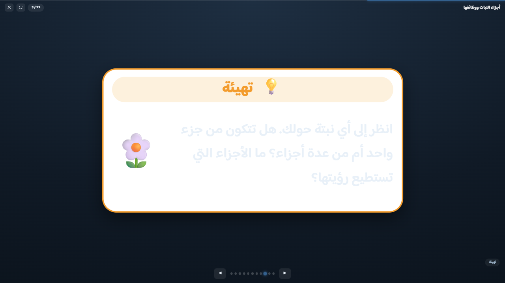

# Templates

[← README](../README.md) · [Lifecycle](LIFECYCLE.md) · [Templates](TEMPLATES.md) · [JSON](JSON.md) · [Render API](API.md) · [Pipeline](PIPELINE.md) · [Database](DATABASE.md) · [Deploy](DEPLOY.md) · [Extending](EXTENDING.md)

Six templates. One `meta.template` value picks the module in `assets/js/templates/` that draws
the sheet; everything else — the ages, the colors, printing, presenting — is shared.

This page is what each template *is* and how it behaves. For the fields you write, see
[JSON.md](JSON.md); for the gallery, see the [README](../README.md#six-templates-two-ages-any-color).

| `meta.template` | produces | on screen | answerable |
|---|---|---|---|
| `worksheet` | the full student worksheet — a 3-column grid of activity cards | interactive | yes |
| `interactive-card` | cut-out review **question** cards, 2×N with scissor guides | interactive | yes |
| `interactive-card-answers` | the matching **model-answer** cards, with note + skill + score | read-only | no |
| `differentiated-lesson` | a complete differentiated-instruction lesson plan | read-only | no |
| `golden-minutes` | the teacher's golden-minutes session card | fillable | no |
| `learning-pattern` | the learning-styles survey | interactive | yes |

Every template prints to **exactly one A4 page**, verified by PDF render.

Each template module exports the same four hooks, which is the whole of the contract:

| hook | when | what |
|---|---|---|
| `render(data)` | once | the markup for the sheet |
| `wire(app)` | after render | attaches behaviour; may return an API object |
| `reset(app)` | 🔄 | clears everything the reader filled in |
| `slides(app)` | presentation mode | which elements are slides, and their titles |

---

## Worksheet

The general-purpose sheet: a masthead, an info block, and a grid of activity cards. The card types
are pluggable — `assets/js/sections/` has one module each for questions, fill-in-the-blank, matching,
classification, choosing, drawing, notes, homework, self-assessment and signatures. Mix them freely.

## Interactive review cards

`interactive-card` prints a 2×N grid of cut-out cards with scissor guides, one question per card.
`interactive-card-answers` is the same deck with the model answers, a teaching note, the skill it
exercises and a score box — the teacher's half. Both take the same question list, so a deck and its
key never drift apart.

## Differentiated lesson plan

A one-page differentiated-instruction plan: goals, strategies, tools and a homework sidebar; level
groups; leveled activities and assessment; a closing strip. Read-only — it is a plan, not a
worksheet.

The three level colors survive **both** themes. They are a legend, not decoration: a plan where
"المستوى الأول" is green in one theme and grey in another is a plan you cannot read across.

## Golden-minutes card

بطاقة الدقائق الذهبية للحصة — session data, the first-five and last-five minute plans, readiness and
decision checklists, and note/teacher/visitor blocks. Fillable on screen and on paper.

## Learning-styles survey

استبيان تحديد أنماط التعلم — a VARK-style questionnaire. Two things make it unusual, and one thing
used to and no longer does.

**Its questions are predefined.** They ship in the JSON, they are the same for every student, and
each statement declares the learning style it feeds. Trimming the instrument
(`counts.questions = N`) draws N statements *per style*, so no style can vanish from its own survey
and no style ends up with a different ceiling from the others.

**An answer is a point on a scale, not a choice.** The `scale` drives three things at once: the
legend chips, the column headers, and what each tick is worth. A 3- or 5-point scale needs no other
change and no new CSS.

**It no longer marks itself.** The sheet used to carry a third section — score bars per style and a
live verdict — that recounted on every tick. That section is gone. A learning-pattern sheet is a
*question* sheet, exactly like a worksheet or a card deck: it collects ticks, and the scoring
happens on the server when it is submitted, against a key stored beside the assignment. The result
reaches the student in the panel they see after submitting, and the teacher on the report page.

Why: a page that carries its own marking is a page whose result can be read — or edited — before it
is submitted, and it is the one template that was breaking the rule every other one obeys. It also
means a survey now flows through the same pipeline as everything else — issue, answer, grade,
analyse, deliver, report — instead of being a dead end that produced nothing a teacher could collect.

→ [LIFECYCLE.md § 7](LIFECYCLE.md#7--analyse--what-it-means) for the scoring rule.

### On a classroom screen

Presentation mode shows the survey **one statement per slide**: the aim card first (so the scale
legend is on screen), then each statement on its own, blown up, with the scale as full-width
buttons. A sixteen-row grid projected at once is unreadable and unanswerable — nobody can see which
row is being asked about.

---

## Presentation mode

*The sheet on the classroom board.*

Press **F5**, or the 🎬 **عرض** button, and the same sheet becomes a slide deck: a cover slide, then
every activity card on its own, scaled up to fill a projector.

*Slide 3 of 11 — the تهيئة (warm-up) card of `science-g1-plant-parts`, blown up on a dark stage.*

Cards are **moved**, not re-rendered, so every answer the class has already typed — and every
listener on the card — survives both the trip onto the stage and the trip back. The scale-up is a
CSS transform, so text stays vector-crisp at any projector resolution.

| Key | Action |
|---|---|
| `F5` | start the show |
| `←` · `Space` · `PageDown` · `Enter` | next slide |
| `→` · `PageUp` · `Backspace` | previous slide |
| `Home` · `End` | first / last slide |
| `F` | fullscreen |
| `Esc` | exit, sheet restored exactly as it was |

On-screen arrows, the dot strip, click-to-advance and touch swipe all do the same thing. From code:
`EduWorksheet.present()`, `.nextSlide()`, `.goToSlide(i)`, `.exitPresent()` — see [JS API](API.md#js-api).

---

## Printing & saving as an image

Every sheet is A4-proportioned (794px ≈ 210mm wide). The 🖨️ button (or Ctrl+P) prints on **a single
A4 page** with colors preserved; the toolbar, drawing tools and on-screen hints are hidden
automatically.

The 🖼️ **حفظ صورة** button works on **every template**: it captures the live sheet (including
typed answers) with html2canvas and downloads a high-resolution **A4-portrait JPG**
(1654 × 2339 ≈ 200 dpi), named after the lesson title. The library is vendored at
`assets/js/vendor/html2canvas.min.js` and loaded lazily on the first click (CDN fallback), so it
costs nothing until used. Letter-spacing is flattened during capture — html2canvas would otherwise
break Arabic ligature shaping.

The card templates additionally set `min-height: 1123px` (A4 at 96dpi) and let the card grid stretch,
so the cut-out cards fill the page evenly instead of bunching at the top. That min-height is dropped
below 820px viewport width, where it would only create dead space.

Long content still flows onto a second page rather than being clipped — cards themselves never split
across pages (`break-inside: avoid`).

**From a server / headless browser:** add `?image=1` or `?print=1` to any sheet URL (or pass
`image: true` to the render API) and the page performs that action itself once painted. The image
job signals completion with `document.documentElement.dataset.eduImage === "done"`, which is what a
Puppeteer/Playwright script waits on — see [docs/API.md](API.md#getting-a-pngjpg-or-a-pdf).

---
